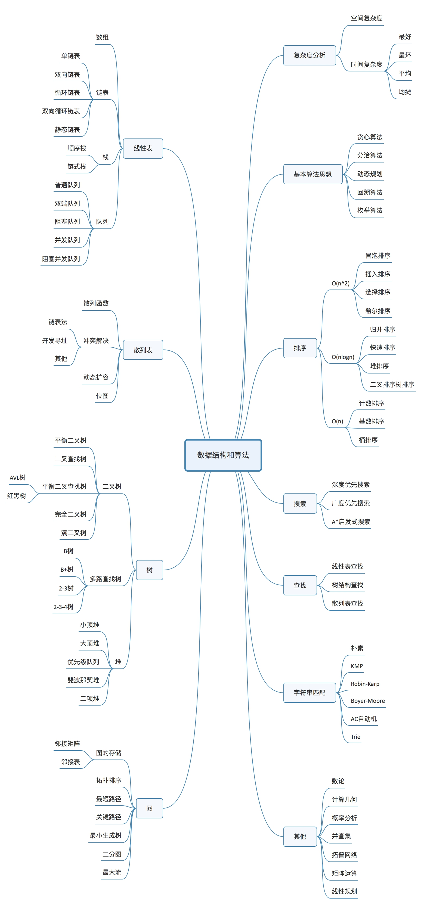

# LeetCode - 分类别

## 算法思维导图

优先打牢10 个数据结构：数组、链表、栈、队列、散列表、二叉树、堆、跳表、图、Trie树；

优先打牢10个算法：递归、排序、二分查找、搜索、哈希算法、贪心算法、分治算法、回溯算法、动态规划、字符串匹配。

## 题目索引（进行中）

<table>
  <thead>
    <tr>
      <th style="text-align:left">#</th>
      <th style="text-align:left">Title</th>
      <th style="text-align:left">&#x96BE;&#x5EA6;</th>
      <th style="text-align:left">Frequency</th>
      <th style="text-align:left">Time</th>
      <th style="text-align:left">Tags</th>
    </tr>
  </thead>
  <tbody>
    <tr>
      <td style="text-align:left">1</td>
      <td style="text-align:left">Two Sum</td>
      <td style="text-align:left">Easy</td>
      <td style="text-align:left">5</td>
      <td style="text-align:left">O(n)</td>
      <td style="text-align:left">
        
Array

        
HashTable

      </td>
    </tr>
  </tbody>
</table>