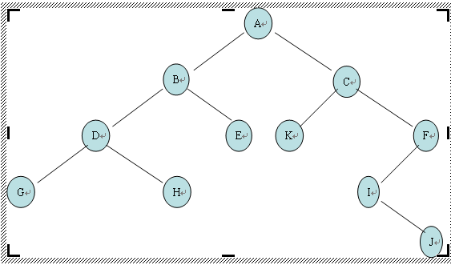

# Tree

## 144 Binary Tree Preorder Traversal

### 原题概述

Given a binary tree, return the _preorder_ traversal of its nodes' values.

**Example:**

```text
Input: [1,null,2,3]
   1
    \
     2
    /
   3

Output: [1,2,3]
```

**Follow up:** Recursive solution is trivial, could you do it iteratively?

### 题意和分析

前序遍历，根左右。

### 代码

递归

```java
/**
 * Definition for a binary tree node.
 * public class TreeNode {
 *     int val;
 *     TreeNode left;
 *     TreeNode right;
 *     TreeNode(int x) { val = x; }
 * }
 */
class Solution {
    public List<Integer> preorderTraversal(TreeNode root) {
        List<Integer> result = new ArrayList<>();
        preorderTraversalHelper(root, result);
        return result;
    }
    private void preorderTraversalHelper(TreeNode root, List<Integer> result) {
        if (root == null) {
            return;
        }
        result.add(root.val);
        preorderTraversalHelper(root.left, result);
        preorderTraversalHelper(root.right, result);
    }
}
```

迭代

```java
/**
 * Definition for a binary tree node.
 * public class TreeNode {
 *     int val;
 *     TreeNode left;
 *     TreeNode right;
 *     TreeNode(int x) { val = x; }
 * }
 */
class Solution {
    public List<Integer> preorderTraversal(TreeNode root) {
        List<Integer> result = new ArrayList<>();
        Stack<TreeNode> stack = new Stack<>();

        TreeNode current = root;
        while (current != null) {
            result.add(current.val);
            if (current.right != null) {//按照从上到下，逐次放入右儿子
                stack.push(current.right);
            }
            current = current.left;
            if (current == null && !stack.isEmpty()) {//说明左儿子已经放完了
                current = stack.pop();
            }
        }
        return result;
    }
}
```

## 145 Binary Tree Postorder Traversal

### 原题概述

Given a binary tree, return the _postorder_ traversal of its nodes' values.

**Example:**

```text
Input: [1,null,2,3]
   1
    \
     2
    /
   3

Output: [3,2,1]
```

**Follow up:** Recursive solution is trivial, could you do it iteratively?

### 题意和分析

后序遍历，左右根。

### 代码

递归

```java
class Solution {
    public List<Integer> postorderTraversal(TreeNode root) {
        List<Integer> result = new ArrayList<Integer>();
        postorderTraversal (root, result);
        return result;
    }
    private void postorderTraversal(TreeNode root, List<Integer> result) {
        if (root == null) {
            return;
        }
        postorderTraversal (root.left, result);
        postorderTraversal (root.right, result);
        result.add(root.val);
    }
}
```

迭代，可以用不同的数据结构，从后往前插入比较方便

```java
/**
 * Definition for a binary tree node.
 * public class TreeNode {
 *     int val;
 *     TreeNode left;
 *     TreeNode right;
 *     TreeNode(int x) { val = x; }
 * }
 */
class Solution {
    public List<Integer> postorderTraversal(TreeNode root) {
        LinkedList<Integer> result = new LinkedList<>();
        Stack<TreeNode> stack = new Stack<>();

        if (root == null) {
            return result;
        }

        stack.push(root);

        while (!stack.isEmpty()) {
            TreeNode current = stack.pop();
            result.addFirst(current.val);
            if (current.left != null) {
                stack.push(current.left);
            }
            if (current.right != null) {
                stack.push(current.right);
            }
        }
        return result;
    }
}
```

```java
/**
 * Definition for a binary tree node.
 * public class TreeNode {
 *     int val;
 *     TreeNode left;
 *     TreeNode right;
 *     TreeNode(int x) { val = x; }
 * }
 */
class Solution {
    public List<Integer> postorderTraversal(TreeNode root) {
        List<Integer> result = new ArrayList<>();
        if (root == null) {
            return result;
        }
        Stack<TreeNode> stack = new Stack<>();

        stack.push(root);

        while (!stack.isEmpty()) {
            TreeNode current = stack.pop();
            result.add(0, current.val);
            if (current.left != null) {
                stack.push(current.left);
            }
            if (current.right != null) {
                stack.push(current.right);
            }
        }
        return result;
    }
}
```

## 94 Binary Tree Inorder Traversal

### 原题概述

Given a binary tree, return the _inorder_ traversal of its nodes' values.

**Example:**

```text
Input: [1,null,2,3]
   1
    \
     2
    /
   3

Output: [1,3,2]
```

**Follow up:** Recursive solution is trivial, could you do it iteratively?

### 题意和分析

中序遍历，左根右。

### 代码

递归

```java
/**
 * Definition for a binary tree node.
 * public class TreeNode {
 *     int val;
 *     TreeNode left;
 *     TreeNode right;
 *     TreeNode(int x) { val = x; }
 * }
 */
class Solution {
    public List<Integer> inorderTraversal(TreeNode root) {
        List<Integer> result = new ArrayList<>();
        inorderTraversalHelper(root, result);
        return result;
    }
    private void inorderTraversalHelper(TreeNode root, List<Integer> result) {
        if (root == null) {
            return;
        }
        inorderTraversalHelper(root.left, result);
        result.add(root.val);
        inorderTraversalHelper(root.right, result);
    }
}
```

迭代

```java
/**
 * Definition for a binary tree node.
 * public class TreeNode {
 *     int val;
 *     TreeNode left;
 *     TreeNode right;
 *     TreeNode(int x) { val = x; }
 * }
 */
class Solution {
    public List<Integer> inorderTraversal(TreeNode root) {
        List<Integer> result = new ArrayList<>();
        Stack<TreeNode> stack = new Stack<>();

        TreeNode current = root;

        while (current != null || !stack.isEmpty()) {
            while (current != null) {
                stack.add(current);
                current = current.left;//先移动指针去左儿子
            }
            //左儿子没了开始从二叉树的最底层弹，同时考虑每个结点的右儿子
            current = stack.pop();
            result.add(current.val);//这时候可以add了
            current = current.right;
        }
        return result;
    }
}
```

## 230 Kth Smallest Element in BST

### 原题概述

Given a binary search tree, write a function `kthSmallest` to find the **k**th smallest element in it.

**Note:**  
You may assume k is always valid, 1 ≤ k ≤ BST's total elements.

**Example 1:**

```text
Input: root = [3,1,4,null,2], k = 1
   3
  / \
 1   4
  \
   2
Output: 1
```

**Example 2:**

```text
Input: root = [5,3,6,2,4,null,null,1], k = 3
       5
      / \
     3   6
    / \
   2   4
  /
 1
Output: 3
```

**Follow up:**  
What if the BST is modified \(insert/delete operations\) often and you need to find the kth smallest frequently? How would you optimize the kthSmallest routine?

### 题意和分析

使用中序遍历，遍历到第k个元素就是第k小的，作为结果返回，因为BST的中序遍历的结果刚好是从小到大排列，同样，也可以通过递归和迭代来做。

### 代码

迭代解法，将k左子树的元素放入到stack中，如果不够k再放入右子树的元素，然后到k后就返回当前值

```java
/**
 * Definition for a binary tree node.
 * public class TreeNode {
 *     int val;
 *     TreeNode left;
 *     TreeNode right;
 *     TreeNode(int x) { val = x; }
 * }
 */
class Solution {
  public int kthSmallest(TreeNode root, int k) {
    Stack<TreeNode> stack = new Stack<>();

    TreeNode current = root;
    while(current != null || !stack.isEmpty()) {
      while (current != null) {
        stack.push(current);
        current = current.left;
      }
      current = stack.pop();
      k--;
      if (k == 0) {
        return current.val;
      }
      current = current.right;
    }
    throw new IllegalArgumentException("There is no kth smallest element.");
  }
}
```

递归解法，先递归左子树，不够再递归右子树，到k个时返回即可

```java
/**
 * Definition for a binary tree node.
 * public class TreeNode {
 *     int val;
 *     TreeNode left;
 *     TreeNode right;
 *     TreeNode(int x) { val = x; }
 * }
 */
class Solution {
  private static int count = 0;
  private static int result = 0;
  public int kthSmallest(TreeNode root, int k) {
    count = k;
    kthSmallestHelper(root);
    return result;
  }
  private void kthSmallestHelper(TreeNode current) {
    if (current.left != null) {
      kthSmallestHelper(current.left);
    }
    count--;
    if (count == 0) {
      result = current.val;
      return;
    }
    if (current.right != null) {
      kthSmallestHelper(current.right);
    }
  }
}
```

## 102 Binary Tree Level Order Traversal

### 原题概述

Given a binary tree, return the level order traversal of its nodes' values. \(ie, from left to right, level by level\).

For example:  
Given binary tree `[3,9,20,null,null,15,7]`,  


```text
    3
   / \
  9  20
    /  \
   15   7
```

return its level order traversal as:  


```text
[
  [3],
  [9,20],
  [15,7]
]
```

### 题意和分析

层序遍历，掌握BFS和递归的写法。

### 代码

BFS

```java
/**
 * Definition for a binary tree node.
 * public class TreeNode {
 *     int val;
 *     TreeNode left;
 *     TreeNode right;
 *     TreeNode(int x) { val = x; }
 * }
 */
class Solution {
    public List<List<Integer>> levelOrder(TreeNode root) {
        List<List<Integer>> result = new ArrayList<List<Integer>>();
        if (root == null) {
            return result;
        }
        Queue<TreeNode> queue = new LinkedList<>();
        queue.add(root);

        while (!queue.isEmpty()) {
            int size = queue.size();// 每一层的元素个数
            List<Integer> level = new ArrayList();
            while (size > 0) {//BFS
                TreeNode node = queue.poll();
                level.add(node.val);
                if (node.left != null) {
                    queue.add(node.left);
                }
                if (node.right != null) {
                    queue.add(node.right);
                }
                size--;
            }
            result.add(level);
        }
        return result;
    }
}
```

递归\([层序遍历各种题总结](https://leetcode.com/problems/binary-tree-level-order-traversal/discuss/114449/A-general-approach-to-level-order-traversal-questions-in-Java)\)

```java
/**
 * Definition for a binary tree node.
 * public class TreeNode {
 *     int val;
 *     TreeNode left;
 *     TreeNode right;
 *     TreeNode(int x) { val = x; }
 * }
 */
class Solution {
    public List<List<Integer>> levelOrder(TreeNode root) {
        List<List<Integer>> result = new ArrayList<List<Integer>>();
        if (root == null) {
            return result;
        }
        levelOrderHelper(result, root, 0);
        return result;
    }
    private void levelOrderHelper(List<List<Integer>> result, TreeNode current, int level) {
        if (current == null) {
            return;
        }
        if (result.size() == level) {//先DFS一条路走到底把每一层的arraylist创建好，然后回溯的时候在call stack中取到level的值，把对应的层的值传进去
            result.add(new ArrayList<Integer>());
        }
        result.get(level).add(current.val);

        levelOrderHelper(result, current.left, level + 1);
        levelOrderHelper(result, current.right, level + 1);
    }
}
```

## 104 - Maximum Depth of Binary Tree

### 原题概述

Given a binary tree, find its maximum depth.

The maximum depth is the number of nodes along the longest path from the root node down to the farthest leaf node.

**Note:** A leaf is a node with no children.

**Example:**

Given binary tree `[3,9,20,null,null,15,7]`,

```text
    3
   / \
  9  20
    /  \
   15   7
```

return its depth = 3.

### 题意和分析

给一颗二叉树，找到其最大的深度并返回。可以用递归，DFS和BFS来做。

### 代码

递归做法

```java
/**
 * Definition for a binary tree node.
 * public class TreeNode {
 *     int val;
 *     TreeNode left;
 *     TreeNode right;
 *     TreeNode(int x) { val = x; }
 * }
 */
class Solution {
    public int maxDepth(TreeNode root) {
        if (root == null) {
            return 0;
        }
        return 1 + Math.max(maxDepth(root.left), maxDepth(root.right));//只要root不为null，深度至少为1
    }
}
```

DFS，用两个stack，一个用来记录Tree的结点，另一个用来记录最大深度，了解下即可。

```java
/**
 * Definition for a binary tree node.
 * public class TreeNode {
 *     int val;
 *     TreeNode left;
 *     TreeNode right;
 *     TreeNode(int x) { val = x; }
 * }
 */
class Solution {
    public int maxDepth(TreeNode root) {
        if (root == null) {
            return 0;
        }
        Stack<TreeNode> stack = new Stack<>();//存储树节点
        Stack<Integer> depth = new Stack<>();//存储树的深度
        stack.push(root);//初始化
        depth.push(1);//root不为null，则深度至少为1
        int maxDepth = 0;
        while (!stack.isEmpty()) {//只要stack中的元素还没有弹完
            int temp = depth.pop();//每轮先弹出上一轮的“最大深度“进行比较
            maxDepth = Math.max(temp, maxDepth);

            TreeNode node = stack.pop();
            if (node.left != null) {
                stack.push(node.left);
                depth.push(temp + 1);//在上一轮最大值的基础上，DFS多了一层
            }
            if (node.right != null) {
                stack.push(node.right);
                depth.push(temp + 1);
            }
        }
        return maxDepth;
    }
}
```

BFS，用Queue来实现

```java
/**
 * Definition for a binary tree node.
 * public class TreeNode {
 *     int val;
 *     TreeNode left;
 *     TreeNode right;
 *     TreeNode() {}
 *     TreeNode(int val) { this.val = val; }
 *     TreeNode(int val, TreeNode left, TreeNode right) {
 *         this.val = val;
 *         this.left = left;
 *         this.right = right;
 *     }
 * }
 */
class Solution {
    public int maxDepth(TreeNode root) {
        if (root == null) {
            return 0;
        }
        Queue<TreeNode> queue = new LinkedList<>();
        queue.offer(root);
        
        int depth = 0;
        
        while (!queue.isEmpty()) {
            int currentSize = queue.size();
            for (int i = 0; i < currentSize; i++) {
                TreeNode node = queue.poll();//node本身不用做任何检查
                
                if (node.left != null) {
                    queue.offer(node.left);
                }
                if (node.right != null) {
                    queue.offer(node.right);
                }
            }
            depth++;
        }
        return depth;
    }
}
```

## 107 Binary Tree Level Order Traversal II

### 原题概述

Given a binary tree, return the bottom-up level order traversal of its nodes' values. \(ie, from left to right, level by level from leaf to root\).

For example:  
Given binary tree `[3,9,20,null,null,15,7]`,  


```text
    3
   / \
  9  20
    /  \
   15   7
```

return its bottom-up level order traversal as:  


```text
[
  [15,7],
  [9,20],
  [3]
]
```

### 题意和分析

跟102比，DFS - 递归到最后一层再加,递的过程中先在总list的头部建好各层的list，最后取层数的时候从最后开始取，results.get\(results.size\(\) - 1 - level\).add\(current.val\)； BFS - 加每一层list的时候直接加在总list 0的位置；

### 代码

DFS

```java
/**
 * Definition for a binary tree node.
 * public class TreeNode {
 *     int val;
 *     TreeNode left;
 *     TreeNode right;
 *     TreeNode(int x) { val = x; }
 * }
 */
class Solution {
    public List<List<Integer>> levelOrder(TreeNode root) {
        List<List<Integer>> result = new ArrayList<List<Integer>>();
        if (root == null) {
            return result;
        }
        levelOrderHelper(result, root, 0);
        return result;
    }
    private void levelOrderHelper(List<List<Integer>> result, TreeNode current, int level) {
        if (current == null) {
            return;
        }
        if (result.size() == level) {//先DFS一条路走到底把每一层的arraylist创建好，然后回溯的时候在call stack中取到level的值，把对应的层的值传进去
            result.add(new ArrayList<Integer>());
        }
        result.get(result.size() - 1 - level).add(current.val);

        levelOrderHelper(result, current.left, level + 1);
        levelOrderHelper(result, current.right, level + 1);
    }
}
```

BFS

```java
/**
 * Definition for a binary tree node.
 * public class TreeNode {
 *     int val;
 *     TreeNode left;
 *     TreeNode right;
 *     TreeNode(int x) { val = x; }
 * }
 */
class Solution {
    public List<List<Integer>> levelOrderBottom(TreeNode root) {
        List<List<Integer>> result = new ArrayList<>();
        if (root == null) {
            return result;
        }
        Queue<TreeNode> queue = new LinkedList<>();
        queue.offer(root);

        while (!queue.isEmpty()) {
            int size = queue.size();
            List<Integer> oneLevel = new ArrayList<>();
            while (size > 0) {
                TreeNode node = queue.poll();
                oneLevel.add(node.val);
                if (node.left != null) {
                    queue.add(node.left);
                }
                if (node.right != null) {
                    queue.add(node.right);
                }
                size--;
            }
            result.add(0, oneLevel);//唯一的不同点
        }
        return result;
    }
}
```

## 103 Binary Tree Zigzag Level Order Traversal

### 原题

Given a binary tree, return the zigzag level order traversal of its nodes' values. \(ie, from left to right, then right to left for the next level and alternate between\).

For example:  
Given binary tree `[3,9,20,null,null,15,7]`,  


```text
    3
   / \
  9  20
    /  \
   15   7
```

return its zigzag level order traversal as:  


```text
[
  [3],
  [20,9],
  [15,7]
]
```

### 分析

1\) BFS，可以用102普通层序遍历的办法，做个标记flag，第一层从左到右向遍历，第二层从右到左遍历，第三层从左到右遍历，so on and so forth，不过普通层序遍历是用一个queue来实现，这里可以用两个queue或者两个stack实现方向的转换，Java的API则直接使用一个双端队列。


实现 BFS 的两个方法：

* 使用两层嵌套循环。外层循环迭代树的层级，内层循环迭代每层上的节点，这是上面102/107的做法，也是标准的BFS做法。
* 也可以使用一层循环实现 BFS。将要访问的节点添加到队列中，使用 分隔符（例如：空节点）把不同层的节点分隔开。分隔符表示一层结束和新一层开始。

在其中第二种方法的基础上，可以借助双端队列实现锯齿形顺序。在每一层，使用一个空的双端队列保存该层所有的节点。根据每一层的访问顺序，即从左到右或从右到左，决定从双端队列的哪一端插入节点。

时间和空间复杂度均为O\(n\)，n为节点个数。


2\) DFS，利用递归栈保存层数的信息，时间复杂度为O\(n\)，空间O\(H\)，n为节点个数，H为二叉树的高度。


### 代码

BFS

标准BFS

```java
/**
 * Definition for a binary tree node.
 * public class TreeNode {
 *     int val;
 *     TreeNode left;
 *     TreeNode right;
 *     TreeNode() {}
 *     TreeNode(int val) { this.val = val; }
 *     TreeNode(int val, TreeNode left, TreeNode right) {
 *         this.val = val;
 *         this.left = left;
 *         this.right = right;
 *     }
 * }
 */
class Solution {
    public List<List<Integer>> zigzagLevelOrder(TreeNode root) {
        List<List<Integer>> result = new ArrayList<>();
        if (root == null) {
            return result;
        }
        Deque<TreeNode> queue = new LinkedList<>();
        queue.offer(root);
        boolean odd = true; // 用来标记flag，以此决定从哪个方向遍历该层，或者用个int整数判断奇偶也行
        
        while (!queue.isEmpty()) {
            List<Integer> oneLevel = new LinkedList<>();
            int count = queue.size();
            for (int i = 0; i < count; i++) {
                TreeNode node = queue.poll();
                if (odd) {// 判断奇偶数的行
                    oneLevel.add(node.val);
                } else {
                    oneLevel.add(0, node.val); // 偶数行插入到头部
                }
                
                if (node.left != null) {
                    queue.offer(node.left);
                }
                if (node.right != null) {
                    queue.offer(node.right);
                }
            }
            result.add(oneLevel);
            odd = !odd;
        }
        return result;
    }
}
```

一层循环的BFS，并且用linkedlist来实现

```java
/**
 * Definition for a binary tree node.
 * public class TreeNode {
 *     int val;
 *     TreeNode left;
 *     TreeNode right;
 *     TreeNode() {}
 *     TreeNode(int val) { this.val = val; }
 *     TreeNode(int val, TreeNode left, TreeNode right) {
 *         this.val = val;
 *         this.left = left;
 *         this.right = right;
 *     }
 * }
 */
class Solution {
    public List<List<Integer>> zigzagLevelOrder(TreeNode root) {
        List<List<Integer>> result = new ArrayList<>();
        if (root == null) {
            return result;
        }
        // add the root element with a delimiter to kick off the BFS loop
        LinkedList<TreeNode> queue = new LinkedList<TreeNode>();
        queue.addLast(root);
        queue.addLast(null); // 每个节点末尾加一个分隔符

        LinkedList<Integer> oneLevel = new LinkedList<Integer>();
        boolean odd = true;

        while (queue.size() > 0) {
            TreeNode node = queue.pollFirst();
            if (node != null) { // 节点后面跟的分隔符就是null
                if (odd) {
                    oneLevel.addLast(node.val);
                } else {
                    oneLevel.addFirst(node.val);
                }

                if (node.left != null) {
                    queue.addLast(node.left);
                }
                if (node.right != null) {
                    queue.addLast(node.right);
                }

            } else {
                // we finish the scan of one level
                result.add(oneLevel);
                oneLevel = new LinkedList<Integer>();
                // prepare for the next level
                if (queue.size() > 0)
                    queue.addLast(null);
                odd = !odd;
            }
        }
        return result;
    }
}
```

DFS

```java
/**
 * Definition for a binary tree node.
 * public class TreeNode {
 *     int val;
 *     TreeNode left;
 *     TreeNode right;
 *     TreeNode() {}
 *     TreeNode(int val) { this.val = val; }
 *     TreeNode(int val, TreeNode left, TreeNode right) {
 *         this.val = val;
 *         this.left = left;
 *         this.right = right;
 *     }
 * }
 */
class Solution {
    public List<List<Integer>> zigzagLevelOrder(TreeNode root) {
        List<List<Integer>> result = new ArrayList<>();
        dfs(result, root, 0);
        return result;
    }

    private void dfs(List<List<Integer>> result, TreeNode root, int depth) {
        if (root == null) { // corner case
            return;
        }
        if (result.size() == depth) { // 该层已经遍历完，从0开始
            result.add(new LinkedList<>());
        } 
        if (depth % 2 == 0) { // 奇数层加到尾部
            result.get(depth).add(root.val);
        } else { // 偶数层加到头部
            result.get(depth).add(0, root.val);
        }
        dfs(result, root.left, depth + 1);
        dfs(result, root.right, depth + 1);
    }
}
```

## 111 Minimum Depth of Binary Tree

### 原题概述

Given a binary tree, find its minimum depth.

The minimum depth is the number of nodes along the shortest path from the root node down to the nearest leaf node.

**Note:** A leaf is a node with no children.

**Example:**

Given binary tree `[3,9,20,null,null,15,7]`,

```text
    3
   / \
  9  20
    /  \
   15   7
```

return its minimum depth = 2.

### 题意和分析

同样的递归解法，与104类似，需要检查下是否到达叶子结点。

### 代码

```java
/**
 * Definition for a binary tree node.
 * public class TreeNode {
 *     int val;
 *     TreeNode left;
 *     TreeNode right;
 *     TreeNode() {}
 *     TreeNode(int val) { this.val = val; }
 *     TreeNode(int val, TreeNode left, TreeNode right) {
 *         this.val = val;
 *         this.left = left;
 *         this.right = right;
 *     }
 * }
 */
class Solution {
    public int minDepth(TreeNode root) {
        if (root == null) {
            return 0;
        }
        if (root.left == null && root.right == null) {
            return 1;
        }
        if (root.left == null) {
            return minDepth(root.right) + 1;
        }
        if (root.right == null) {
            return minDepth(root.left) + 1;
        }
        return Math.min(minDepth(root.left), minDepth(root.right)) + 1;
    }
}
```

BFS迭代解法锻炼思维

```java
/**
 * Definition for a binary tree node.
 * public class TreeNode {
 *     int val;
 *     TreeNode left;
 *     TreeNode right;
 *     TreeNode() {}
 *     TreeNode(int val) { this.val = val; }
 *     TreeNode(int val, TreeNode left, TreeNode right) {
 *         this.val = val;
 *         this.left = left;
 *         this.right = right;
 *     }
 * }
 */
class Solution {
    public int minDepth(TreeNode root) {
        if (root == null) {
            return 0;
        }
        int depth = 1;
        Queue<TreeNode> queue = new LinkedList<>();
        queue.offer(root);
        
        while (!queue.isEmpty()) {
            int currentSize = queue.size();
            
            for (int i = 0; i < currentSize; i++) {
                TreeNode node = queue.poll();
                if (node.left == null && node.right == null) {
                    return depth; // 遇到第一个叶子节点立即返回，确保最小深度
                }
                if (node.left != null) {
                    queue.offer(node.left);
                }
                if (node.right != null) {
                    queue.offer(node.right);
                }
            }
            depth++;
        }
        return depth;
    }
}
```

## 226 - Invert Binary Tree

### 原题概述

Invert a binary tree.

**Example:**

Input:

```text
     4
   /   \
  2     7
 / \   / \
1   3 6   9
```

Output:

```text
     4
   /   \
  7     2
 / \   / \
9   6 3   1
```

**Trivia:**  
This problem was inspired by [this original tweet](https://twitter.com/mxcl/status/608682016205344768) by [Max Howell](https://twitter.com/mxcl):

> Google: 90% of our engineers use the software you wrote \(Homebrew\), but you can’t invert a binary tree on a whiteboard so f\*\*\* off.

### 题意和分析

同样可以用递归，DFS和BFS来做。

### 代码

递归的写法很简单，只是复杂度没有什么好优化的。

```java
/**
 * Definition for a binary tree node.
 * public class TreeNode {
 *     int val;
 *     TreeNode left;
 *     TreeNode right;
 *     TreeNode(int x) { val = x; }
 * }
 */
class Solution {
    public TreeNode invertTree(TreeNode root) {
        if (root == null) {//递归的终止条件
            return root;
        }
        TreeNode left = invertTree(root.left);
	      TreeNode right = invertTree(root.right);
        
        //递归调用后的最后一步
        root.left = right;
		    root.right = left;

        return root;
    }
}
```

DFS，可以用stack或者deque

```java
/**
 * Definition for a binary tree node.
 * public class TreeNode {
 *     int val;
 *     TreeNode left;
 *     TreeNode right;
 *     TreeNode(int x) { val = x; }
 * }
 */
class Solution {
    public TreeNode invertTree(TreeNode root) {
        if (root == null) {
            return root;
        }
        Stack<TreeNode> stack = new Stack<>();
        stack.push(root);
        while (!stack.isEmpty()) {
            TreeNode node = stack.pop();
            TreeNode left = node.left;
            node.left = node.right;
            node.right = left;

            if (node.left != null) {
                stack.push(node.left);
            }

            if (node.right != null) {
                stack.push(node.right);
            }
        }
        return root;
    }
}
```

BFS，其实就是层序遍历level order traversal，数据结构不一样

```java
/**
 * Definition for a binary tree node.
 * public class TreeNode {
 *     int val;
 *     TreeNode left;
 *     TreeNode right;
 *     TreeNode(int x) { val = x; }
 * }
 */
class Solution {
    public TreeNode invertTree(TreeNode root) {
        if (root == null) {
            return root;
        }
        Queue<TreeNode> queue = new LinkedList<>();
        queue.offer(root);//vs add()

        while (!queue.isEmpty()) {
            TreeNode node = queue.poll();//vs peek()
            TreeNode left = node.left;
            node.left = node.right;
            node.right = left;
            if (node.left != null) {
                queue.offer(node.left);
            }
            if (node.right != null) {
                queue.offer(node.right);
            }
        }
        return root;
    }
}
```

## 617 - Merge Two  Binary Tree

### 原题概述

Given two binary trees and imagine that when you put one of them to cover the other, some nodes of the two trees are overlapped while the others are not.

You need to merge them into a new binary tree. The merge rule is that if two nodes overlap, then sum node values up as the new value of the merged node. Otherwise, the NOT null node will be used as the node of new tree.

**Example 1:**  


```text
Input: 
	Tree 1                     Tree 2                  
          1                         2                             
         / \                       / \                            
        3   2                     1   3                        
       /                           \   \                      
      5                             4   7                  
Output: 
Merged tree:
	     3
	    / \
	   4   5
	  / \   \ 
	 5   4   7
```

**Note:** The merging process must start from the root nodes of both trees.

### 题意和分析

同样可以用递归来做，将一棵树merge到另一颗树中。

### 代码

递归

```java
/**
 * Definition for a binary tree node.
 * public class TreeNode {
 *     int val;
 *     TreeNode left;
 *     TreeNode right;
 *     TreeNode(int x) { val = x; }
 * }
 */
class Solution {
    public TreeNode mergeTrees(TreeNode t1, TreeNode t2) {
        if (t1 == null) {
            return t2;
        }
        if (t2 == null) {
            return t1;
        }
        t1.val += t2.val;//将t2 merge到t1中来
        t1.left = mergeTrees(t1.left, t2.left);
        t1.right = mergeTrees(t1.right, t2.right);

        return t1;
    }
}
```

## 100 - Same Tree

### 原题概述

Given two binary trees, write a function to check if they are the same or not.

Two binary trees are considered the same if they are structurally identical and the nodes have the same value.

**Example 1:**

```text
Input:     1         1
          / \       / \
         2   3     2   3

        [1,2,3],   [1,2,3]

Output: true
```

**Example 2:**

```text
Input:     1         1
          /           \
         2             2

        [1,2],     [1,null,2]

Output: false
```

**Example 3:**

```text
Input:     1         1
          / \       / \
         2   1     1   2

        [1,2,1],   [1,1,2]

Output: false
```

### 题意和分析

用递归和非递归分别实现。

### 代码

递归

```java
/**
 * Definition for a binary tree node.
 * public class TreeNode {
 *     int val;
 *     TreeNode left;
 *     TreeNode right;
 *     TreeNode(int x) { val = x; }
 * }
 */
class Solution {
	public boolean isSameTree(TreeNode p, TreeNode q) {
		if (p == null && q == null) {
			return true;
		} else if (p == null || q == null) {
			return false;
		}
		if (p.val != q.val) {
			return false;
		}
		return isSameTree(p.left, q.left) && isSameTree(p.right, q.right);
	}
}
```

迭代的办法，可以用BFS - Queue或者DFS - Stack来逐个检查，这里用BFS-Queue

```java
/**
 * Definition for a binary tree node.
 * public class TreeNode {
 *     int val;
 *     TreeNode left;
 *     TreeNode right;
 *     TreeNode(int x) { val = x; }
 * }
 */
class Solution {
    public boolean isSameTree(TreeNode p, TreeNode q) {
        if (p == null && q == null) {
            return true;
        }
        if (p == null || q == null) {
            return false;
        }
        Queue<TreeNode> queue = new LinkedList<>();
        queue.offer(p);
        queue.offer(q);

        while (!queue.isEmpty()) {
            TreeNode node1 = queue.poll();
            TreeNode node2 = queue.poll();

            if (node1 == null && node2 == null) {//一直检查到最后为null
                continue;
            } else if (node1 == null || node2 == null || node1.val != node2.val) {
                return false;
            }
            queue.offer(node1.left);
            queue.offer(node2.left);
            queue.offer(node1.right);
            queue.offer(node2.right);
        }
        return true;
    }
}
```

## 173 - Binary Search Tree Iterator

### 原题概述

Implement an iterator over a binary search tree \(BST\). Your iterator will be initialized with the root node of a BST.

Calling `next()` will return the next smallest number in the BST.

**Note:** `next()` and `hasNext()` should run in average O\(1\) time and uses O\(h\) memory, where h is the height of the tree.

### 题意和分析

这道题是对二叉搜索树的遍历，要求next\(\)返回下一个最小的val，next\(\)和hasNext\(\)的时间复杂度为O\(1\)，空间为O\(h\)，其中h为高度。BST的建树规则是left-root-right，这个跟中序遍历一样。

> 每个节点的val值大于左子节点，小于右子节点。注意它不一定是完全的二叉树。所有结点的val值是唯一的。数组的搜索比较方便，可以直接使用下标，但删除或者插入就比较麻烦了，而链表与之相反，删除和插入都比较简单，但是查找很慢，这自然也与这两种数据结构的存储方式有关，数组是取一段相连的空间，而链表是每创建一个节点便取一个节点所需的空间，只是使用指针进行连接，空间上并不是连续的。而二叉树就既有链表的好处，又有数组的优点。



下面的思路来自于[https://blog.csdn.net/smile\_watermelon/article/details/47280679](https://blog.csdn.net/smile_watermelon/article/details/47280679)并做了修改

一个非常简单的解决办法是遍历这棵二叉树，把二叉树的元素以从大到小的方式放到一个栈里，这样next\(\)从栈顶获取元素，hasNext\(\)调用栈不为空的判定方法。这种方法能满足题目中的时间复杂度要求，但是O\(n\)的空间复杂度无法满足题目中O\(h\)空间复杂度要求。

我们维护一个栈，栈中存放的是结点指针，**向栈中添加元素**发生在两种情况下：1.初始化迭代器时；2.调用next\(\)从栈中弹出一个元素时。

我们结合下面的实例来描述这个栈中元素的添加和删除过程。对于hasNext\(\)方法，调用栈的empty\(\)方法即可，不做具体分析，仅分析next\(\)方法以及迭代器的数据结构。

> 假设二叉查找树的结构如下：

```text
         6
       /   \
      5     8
     /     / \
    1     7   9
     \      
      3  
     / \
    2   4
12345678910
```

> （1）栈的初始化，我们把root一直到最左下角的结点都放到stack中，即把如下三个结点放在stack中。

```text
        6    |   |
       /     |   |
      5      | 1 |
     /       | 5 |
    1        |_6_|  <---栈内情况
     注意：上图中栈中存放的应该是指针而不是1,5,6等元素，此处仅用作示意，不代表实际情况，勿生疑。
1234567
```

> （2）第一次调用next\(\)，此时弹出指向元素1的指针tmp，这时候栈内只剩下5,6，如果我们不对栈进行维护的话，我们再调用一次next\(\)将会弹出5，这显然是不对的，因为二叉查找树中还有比5小比2大的元素。因此这时候，我们应当将二叉查找树，或者更准确的说，应该把元素1的右子树上的部分结点添加到栈中。

```text
             |   |
             |   |
             |   |
             | 5 |
             |_6_|  <---栈内情况
123456
```

> （3）那么我们将1（tmp）的右子树上所有结点都放到栈内吗？不，此时添加结点的逻辑与初始化迭代器时类似， 我们只把从tmp-&gt;right为根一直到其最坐下角的结点都放到stack中，即，把3,2两个元素放到栈中。

```text
             |   |
             | 2 |
             | 3 |
             | 5 |
             |_6_|  <---栈内情况
123456
```

> （4）再次调用next\(\)时，返回的将是正确的答案2，然后2并没有右结点，则无须添加新的指针到栈中。

```text
             |   |
             |   |
             | 3 |
             | 5 |
             |_6_|  <---栈内情况
123456
```

> （5）之后的过程与此类似，在此把每次调用next\(\)之后的栈的存储情况列举如下：

```text
             |   |       |   |       |   |       |   |       |   |       |   |       |   |
             |   |       |   |       |   |       |   |       |   |       |   |       |   |
             | 4 |  -->  |   |  -->  |   |  -->  |   |  -->  |   |  -->  |   |  -->  |   |
             | 5 |       | 5 |       |   |       | 7 |       |   |       |   |       |   |
             |_6_|       |_6_|       |_6_|       |_8_|       |_8_|       |_9_|       |___|
123456
```

综上所述，我们在栈中存储的是一部分极小值，且栈顶一定是当前树中未访问过的结点中的最小结点。在调用next\(\)弹出最小结点时，需要把被弹出结点的右子树添加到栈中，也就是把比当前最小结点大但是比次小结点小的那些结点中的一部分（不是全部，只是左孩子分支上的一部分）添加到栈中。

然后，我们的这个数据结构是否满足题目要求。我们可以看到每一个结点一定要进入栈中，且该操作是在构造过程和next\(\)中执行的，其中构造过程只执行一次，而next\(\)执行多次。但是进栈的操作存在差异性，有时候调用next\(\)不会往栈中添加任何元素，有时候会添加多个，但是至多不超过h个，其中h是树的高度，因为添加时只顺着树的左分支往下添加。我们一共要调用n次next\(\)，在这n次调用中，每个结点都进栈/出栈，共n次入栈操作，n次出栈操作，平均起来，**每次next\(\)只有`一次入栈操作+一次出栈操作`**，因此**满足平均时间复杂度O\(1\)**的要求。再看空间复杂度，刚才我们已经说过，在往栈中添加元素时**只顺着树的左分支往下添加**，因此**至多添加h个结点**，其中h就是树的高度，因此**满足空间复杂度O\(h\)**的要求。

### 代码

```java
/**
 * Definition for binary tree
 * public class TreeNode {
 *     int val;
 *     TreeNode left;
 *     TreeNode right;
 *     TreeNode(int x) { val = x; }
 * }
 */

public class BSTIterator {

    public BSTIterator(TreeNode root) {
        while (root != null) {//left - root - right,从最left开始
            stack.push(root);
            root = root.left;
        }
    }

    /** @return whether we have a next smallest number */
    public boolean hasNext() {
        return !stack.isEmpty();
    }

    /** @return the next smallest number */
    public int next() {//
        TreeNode node = stack.pop();
        int result = node.val;
        if (node.right != null) {
            node = node.right;
            while (node != null) {
                stack.push(node);
                node = node.left;
            }
        }
        return result;
    }

    private Stack<TreeNode> stack = new Stack<>();
}

/**
 * Your BSTIterator will be called like this:
 * BSTIterator i = new BSTIterator(root);
 * while (i.hasNext()) v[f()] = i.next();
 */
```

## 96 - Unique Binary Search Trees

### 原题概述

Given _n_, how many structurally unique **BST's** \(binary search trees\) that store values 1 ... _n_?

**Example:**

```text
Input: 3
Output: 5
Explanation:
Given n = 3, there are a total of 5 unique BST's:

   1         3     3      2      1
    \       /     /      / \      \
     3     2     1      1   3      2
    /     /       \                 \
   2     1         2                 3
```

### 题意和分析

这个解释来自[http://fisherlei.blogspot.com/2013/03/leetcode-unique-binary-search-trees.html](http://fisherlei.blogspot.com/2013/03/leetcode-unique-binary-search-trees.html)，略作修改

 如果把上例的顺序改一下，就可以看出规律了。  
 1                1                      2                       3             3  
    \                 \                 /      \                  /              /   
      3               2              1       3               2             1  
    /                   \                                       /                  \  
 2                       3                                   1                    2  
  
比如，以1为根的树有几个，完全取决于有二个元素的子树有几种。同理，2为根的子树取决于一个元素的子树有几个。以3为根的情况，则与1相同。  
  
定义Count\[i\] 为以\[0,i\]能产生的Unique Binary Tree的数目，  
  
如果数组为空，毫无疑问，只有一种BST，即空树，  
Count\[0\] =1  
  
如果数组仅有一个元素{1}，只有一种BST，单个节点  
Count\[1\] = 1  
  
如果数组有两个元素{1,2}， 那么有如下两种可能  
1                       2  
  \                    /  
    2                1  
Count\[2\] = Count\[0\] \* Count\[1\]   \(1为根的情况\)  
                  + Count\[1\] \* Count\[0\]  \(2为根的情况。  
  
再看一遍三个元素的数组，可以发现BST的取值方式如下：  
Count\[3\] = Count\[0\]\*Count\[2\]  \(1为根的情况\)  
               + Count\[1\]\*Count\[1\]  \(2为根的情况\)  
               + Count\[2\]\*Count\[0\]  \(3为根的情况\)  
  
所以，由此观察，可以得出Count的递推公式为


这正是[卡塔兰数](http://zh.wikipedia.org/wiki/%E5%8D%A1%E5%A1%94%E5%85%B0%E6%95%B0)的一种定义方式，是一个典型的动态规划的定义方式（根据其实条件和递推式求解结果）。所以思路也很明确了，维护量res\[i\]表示含有i个结点的二叉查找树的数量。根据上述递推式依次求出1到n的的结果即可。

对于BST是否Unique，很难判断，但引入了一个条件以后，立即就清晰了，**即当数组为 1，2，3，4，.. i，.. n时，基于以下原则的BST建树具有唯一性： 以i为根结点的树，其左子树由\[0, i-1\]构成， 其右子树由\[i+1, n\]构成。**

时间上每次求解i个结点的二叉查找树数量的需要一个i步的循环，总体要求n次，所以总时间复杂度是O\(1+2+...+n\)=O\(n^2\)。空间上需要一个数组来维护，并且需要前i个的所有信息，所以是O\(n\)。

### 代码

```java
class Solution {
    public int numTrees(int n) {
        if (n == 0 || n == 1) {
            return 1;
        }
        int[] trees = new int[n + 1];
        trees[0] = 1;

        // DP递推式：tree[t+1] = trees[i] * trees[t - i]，其中0 <= i <= t
        // 令num = t + 1, 则t = num - 1;
        //递推式转化为:
        //trees[num] += trees[i] * trees[num-1]，其中0 <= i <= num - 1, 1 <= num <= n;
        //trees[0] = 1

        for (int num = 1; num <= n; num++) {
            for (int i = 0; i <= num - 1; i++) {
                trees[num] += trees[i] * trees[(num - 1) - i];
            }
        }
        return trees[n];
    }
}
```

## 95 - Unique Binary Search Trees II

### 原题概述

Given an integer _n_, generate all structurally unique **BST's** \(binary search trees\) that store values 1 ... _n_.

**Example:**

```text
Input: 3
Output:
[
  [1,null,3,2],
  [3,2,null,1],
  [3,1,null,null,2],
  [2,1,3],
  [1,null,2,null,3]
]
Explanation:
The above output corresponds to the 5 unique BST's shown below:

   1         3     3      2      1
    \       /     /      / \      \
     3     2     1      1   3      2
    /     /       \                 \
   2     1         2                 3
```

### 题意和分析

跟上一题相比，这道题要求不是总数，而是打印出所有符合条件的BST。

大致思路如下：

1. 每一次都在一个范围内随机选取一个结点作为根。 
2. 每选取一个结点作为根，就把树切分成左右两个子树，直至该结点左右子树为空。

可以看出这也是一个可以划分成子问题求解的题目，所以考点是动态规划。 但具体对于本题来说，采取的是自底向上的求解过程。

 1. 选出根结点后应该先分别求解该根的左右子树集合，也就是根的左子树有若干种，它们组成左子树集合，根的右子树有若干种，它们组成右子树集合。 

2. 然后将左右子树相互配对，每一个左子树都与所有右子树匹配，每一个右子树都与所有的左子树匹配。然后将两个子树插在根结点上。 

3. 最后，把根结点放入链表中。

### 代码

```java
/**
 * Definition for a binary tree node.
 * public class TreeNode {
 *     int val;
 *     TreeNode left;
 *     TreeNode right;
 *     TreeNode(int x) { val = x; }
 * }
 */
class Solution {
    public List<TreeNode> generateTrees(int n) {
        if (n < 1) {
            return new ArrayList<TreeNode>();
        }
        return helper(1, n);
    }

    private List<TreeNode> helper(int start, int end) {
        List<TreeNode> result = new ArrayList<>();
        if (start > end) {
            result.add(null);
            return result;
        }

        for (int i = start; i <= end; i++) {//在1...n中依次选取结点作为根
            //接下来根据选取的根，把树切分成左右子树，递归直到为空
            List<TreeNode> leftChild = helper(start, i - 1);
            List<TreeNode> rightChild = helper(i + 1, end);
            for (TreeNode left : leftChild) {
                for (TreeNode right : rightChild) {
                    TreeNode root = new TreeNode(i);//当前树的根

                    //根结合上左右子树
                    root.left = left;
                    root.right = right;

                    result.add(root);
                }
            }
        }
        return result;
    }
}
```

## 110 - Balanced Binary Tree

### 原题概述

Given a binary tree, determine if it is height-balanced.

For this problem, a height-balanced binary tree is defined as:

> a binary tree in which the depth of the two subtrees of _every_ node never differ by more than 1.

**Example 1:**

Given the following tree `[3,9,20,null,null,15,7]`:

```text
    3
   / \
  9  20
    /  \
   15   7
```

Return true.  
  
**Example 2:**

Given the following tree `[1,2,2,3,3,null,null,4,4]`:

```text
       1
      / \
     2   2
    / \
   3   3
  / \
 4   4
```

Return false.

### 题意和分析

平衡二叉树的定义：两个子树的高度相差不会超过1，而且左右子树都是平衡的。用动态规划的两个套路，**自底向上**和**自顶向下来解**。

### 代码

自顶向下 - 这个办法利用递归，算出左右子树的深度，然后严格按照平衡二叉树的定义看左右子树的深度是否相差大于1。其中findDepth\(\)的复杂度需要遍历每个结点为O\(n\)，而对所有结点都会执行以下findDepth\(\)，所以总体时间复杂度为O\(n^2\)，空间为O\(n\)。

```java
/**
 * Definition for a binary tree node.
 * public class TreeNode {
 *     int val;
 *     TreeNode left;
 *     TreeNode right;
 *     TreeNode(int x) { val = x; }
 * }
 */
class Solution {
    public boolean isBalanced(TreeNode root) {
        if (root == null) {
            return true;
        }

        //左右子树的深度
        int left = findDepth(root.left);
        int right = findDepth(root.right);

        return Math.abs(left - right) <= 1 //随时检查
                && isBalanced(root.left) && isBalanced(root.right);
    }

    //递归找到子树的深度
    private int findDepth(TreeNode node) {
        if (node == null) {
            return 0;
        }
        return Math.max(findDepth(node.left), findDepth(node.right)) + 1;//node不为0深度至少为1
    }
}
```

自底向上 - 利用DFS，在DFS的递归中返回当前结点的height，如果当前结点的子结点是平衡的，dfsHeight\(\)会返回一个非负整数，如果不平衡就返回-1，然后根据leftHeight和rightHeight的结果来决定一层层上升传递的数值。

```java
/**
 * Definition for a binary tree node.
 * public class TreeNode {
 *     int val;
 *     TreeNode left;
 *     TreeNode right;
 *     TreeNode(int x) { val = x; }
 * }
 */
class Solution {
    public boolean isBalanced(TreeNode root) {
        return dfsHeight(root) != -1;//检查返回的数字决定是否平衡
    }
    private int dfsHeight(TreeNode root) {
        if (root == null) {//递归的终止条件，查到最后还是平衡的就返回-1
            return 0;
        }

        //回溯时层层传递
        int leftHeight = dfsHeight(root.left);
        if (leftHeight == -1) {
            return -1;
        }
        int rightHeight = dfsHeight(root.right);
        if (rightHeight == -1) {
            return -1;
        }

        if (Math.abs(leftHeight - rightHeight) > 1) {
            return -1;
        }

        return Math.max(leftHeight, rightHeight) + 1;//返回当前结点的height
    }
}
```

## 108 - Convert Sorted Array to Binary Search Tree

### 原题概述

Given an array where elements are sorted in ascending order, convert it to a height balanced BST.

For this problem, a height-balanced binary tree is defined as a binary tree in which the depth of the two subtrees of _every_ node never differ by more than 1.

**Example:**

```text
Given the sorted array: [-10,-3,0,5,9],

One possible answer is: [0,-3,9,-10,null,5], which represents the following height balanced BST:

      0
     / \
   -3   9
   /   /
 -10  5
```

### 题意和分析

这道题是要将有序数组转为二叉搜索树，二叉搜索树始终满足左&lt;=根&lt;=右的特性，如果将二叉搜索树按中序遍历的话，得到的就是一个有序数组。那么反过来，根节点应该是有序数组的中间点，从中间点分开为左右两个有序数组，在分别找出其中间点作为原中间点的左右两个子节点，这不就是是二分查找法的核心思想么。所以这道题考的就是二分查找法。

### 代码

```java
/**
 * Definition for a binary tree node.
 * public class TreeNode {
 *     int val;
 *     TreeNode left;
 *     TreeNode right;
 *     TreeNode(int x) { val = x; }
 * }
 */
class Solution {
    public TreeNode sortedArrayToBST(int[] nums) {
        return sortedArrayToBST(nums, 0, nums.length - 1);
    }

    private TreeNode sortedArrayToBST(int[] nums, int left, int right) {//传入起点和终点
        if (left > right) {
            return null;
        }
        int mid = left + (right - left) / 2;
        TreeNode current = new TreeNode(nums[mid]);
        current.left = sortedArrayToBST(nums, left, mid - 1);
        current.right = sortedArrayToBST(nums, mid + 1, right);

        return current;
    }
}
```

## 669 - Trim a Binary Search Tree

### 原题概述

Given a binary search tree and the lowest and highest boundaries as `L` and `R`, trim the tree so that all its elements lies in `[L, R]` \(R &gt;= L\). You might need to change the root of the tree, so the result should return the new root of the trimmed binary search tree.

**Example 1:**  


```text
Input: 
    1
   / \
  0   2

  L = 1
  R = 2

Output: 
    1
      \
       2
```

**Example 2:**  


```text
Input: 
    3
   / \
  0   4
   \
    2
   /
  1

  L = 1
  R = 3

Output: 
      3
     / 
   2   
  /
 1
```

### 题意和分析

给一个边界返回\[L, R\]，修剪给定的BST，所有不在范围内的结点都应该被剪掉，但是剩下的应该还是BST，左&lt;=根&lt;=右，如果是先遍历一遍BST，把符合要求的结点放入到一个Array里面，然后再重建一个新的BST，这样的想法可能会改变原来BST的总体结构；

所以用另外一种思路，在遍历的过程就对二叉树进行修剪，在递归的过程中判定根结点是否在范围中，如果根结点的值小于L，就返回根结点的右子结点调用递归的值；如果根结点大于R，就返回根结点的左子结点调用递归函数的值；如果根结点在范围内，就将起左右子结点同时更新为对其左右子结点调用递归函数的值，最后返回root。

### 代码

```java
/**
 * Definition for a binary tree node.
 * public class TreeNode {
 *     int val;
 *     TreeNode left;
 *     TreeNode right;
 *     TreeNode(int x) { val = x; }
 * }
 */
class Solution {
    public TreeNode trimBST(TreeNode root, int L, int R) {
        if (root == null) {
            return null;
        }
        if (root.val < L) {//左边的结点都不用看了
            return trimBST(root.right, L, R);
        }
        if (root.val > R) {//右边的结点都不用看了
            return trimBST(root.left, L, R);
        }
        
        //root的值在L和R中间的时候
        root.left = trimBST(root.left, L, R);
        root.right = trimBST(root.right, L, R);

        return root;
    }
}
```

同样，也可以用非递归while的办法来代替递归过程

```java
/**
 * Definition for a binary tree node.
 * public class TreeNode {
 *     int val;
 *     TreeNode left;
 *     TreeNode right;
 *     TreeNode(int x) { val = x; }
 * }
 */
class Solution {
    public TreeNode trimBST(TreeNode root, int L, int R) {
        if (root == null) {
            return null;
        }
        while (root.val < L || root.val > R) {
            root = (root.val < L) ? root.right : root.left;
        }
        TreeNode current = root;
        while (current != null) {
            while (current.left != null && current.left.val < L) {
                current.left = current.left.right;//太小，移向右边
            }
            current = current.left;
        }
        current = root;
        while (current != null) {
            while (current.right != null && current.right.val > R) {
                current.right = current.right.left;//太大，移向左边
            }
            current = current.right;
        }

        return root;
    }
}
```

## 101 - Symmetric Tree

### 原题概述

Given a binary tree, check whether it is a mirror of itself \(ie, symmetric around its center\).

For example, this binary tree `[1,2,2,3,4,4,3]` is symmetric:

```text
    1
   / \
  2   2
 / \ / \
3  4 4  3
```

But the following `[1,2,2,null,3,null,3]` is not:  


```text
    1
   / \
  2   2
   \   \
   3    3
```

**Note:**  
Bonus points if you could solve it both recursively and iteratively.

### 题意和分析

判断一个Binary Tree是否是平衡树，两个结点n1和n2，需要判断n1的左子结点和n2的右子结点是否相同，以及n1的右子结点和n2的左子结点是否相同。加分项是用递归和迭代的办法分别做出来。

### 代码

递归

```java
/**
 * Definition for a binary tree node.
 * public class TreeNode {
 *     int val;
 *     TreeNode left;
 *     TreeNode right;
 *     TreeNode(int x) { val = x; }
 * }
 */
class Solution {
	public boolean isSymmetric(TreeNode root) {
		if (root == null) {
			return true;
		}
		return isSymmetricLeftRight(root.left, root.right);
	}
	private boolean isSymmetricLeftRight(TreeNode treeLeft, TreeNode treeRight) {
		if (treeLeft == null && treeRight == null) {
			return true;
		} else if (treeLeft == null || treeRight == null) {
			return false;
		}
		if (treeLeft.val != treeRight.val) {
			return false;
		}
		return isSymmetricLeftRight(treeLeft.left, treeRight.right) && isSymmetricLeftRight(treeLeft.right, treeRight.left);
	}
}
```

非递归，同样的思路做迭代，用Queue来做，把左边的结点和右边分别进行比较即可。

> 队列Queue使用时要尽量避免Collection的add\(\)和remove\(\)方法，而是要使用offer\(\)来加入元素，使用poll\(\)来获取并移出元素。它们的优点是通过返回值可以判断成功与否，add\(\)和remove\(\)方法在失败的时候会抛出异常。 如果要使用前端而不移出该元素，使用element\(\)或者peek\(\)方法。
>
> 另外LinkedList类实现了Queue接口，因此我们可以把LinkedList当成Queue来用。

```java
/**
 * Definition for a binary tree node.
 * public class TreeNode {
 *     int val;
 *     TreeNode left;
 *     TreeNode right;
 *     TreeNode(int x) { val = x; }
 * }
 */
class Solution {
    public boolean isSymmetric(TreeNode root) {
        if (root == null) {
            return true;
        }
        //这里用一个Queue也是可以的，每次while循环依次取出和加入就可以了，为了方便阅读用了两个Queue
        Queue<TreeNode> q1 = new LinkedList<>();
        Queue<TreeNode> q2 = new LinkedList<>();
        q1.offer(root.left);
        q2.offer(root.right);

        while (!q1.isEmpty() && !q2.isEmpty()) {
            TreeNode left = q1.poll();
            TreeNode right = q2.poll();

            if (left == null && right == null) {
                continue;
            }
            if (left == null || right == null || left.val != right.val) {
                return false;
            }

            q1.offer(left.left);
            q1.offer(left.right);
            q2.offer(right.right);
            q2.offer(right.left);
        }
        return true;
    }
}
```

## 124 - Binary Tree Maximum Path Sum

### 原题概述

Given a **non-empty** binary tree, find the maximum path sum.

For this problem, a path is defined as any sequence of nodes from some starting node to any node in the tree along the parent-child connections. The path must contain **at least one node** and does not need to go through the root.

**Example 1:**

```text
Input: [1,2,3]

       1
      / \
     2   3

Output: 6
```

**Example 2:**

```text
Input: [-10,9,20,null,null,15,7]

   -10
   / \
  9  20
    /  \
   15   7

Output: 42
```

### 题意和分析

求二叉树的最大路径，这道题很容易想到DFS，但因为起始位置和结束位置可以是任意位置，所以有点难度。我们知道Tree相关的题目一般都用递归来做，树的递归解法一般是二话不说先递归到leaf，然后回溯到root，同时在回溯的过程中处理结点。以给定的例子稍微改变一下来看

```text
      -10
      / \
     9  20
    /  \
   15   7
```

最长路径为15-&gt;9-&gt;-10-&gt;20，现在递归到了15，接下来回溯到9，这时候以9为root的子树的和为15+9+7=31；然后继续回溯到-10，这个时候得选一条路径，左路径或右路径，因为叶子结点15 &gt; 7，所以选左路径15-&gt;9-&gt;-10而不是7-&gt;9-&gt;-10，所以对回溯到的每个结点，就用递归函数返回值来定义为：当前结点为root，到leaf的最大路径之和，然后保留全局最大值在参数中，然后返回。

在递归函数中，如果当前结点不存在，那么直接返回0。否则就分别对其左右子节点调用递归函数，由于路径和（是 路径的和，不是某个结点的值）有可能为负数，而我们当然不希望加上负的路径和，所以我们和0相比，取较大的那个，就是要么不加，加就要加正数。然后我们来更新全局最大值结果result，就是以左子结点为终点的最大path之和加上以右子结点为终点的最大path之和，还要加上当前结点值，这样就组成了一个条完整的路径。

### 代码

```java
/**
 * Definition for a binary tree node.
 * public class TreeNode {
 *     int val;
 *     TreeNode left;
 *     TreeNode right;
 *     TreeNode(int x) { val = x; }
 * }
 */
class Solution {
    int result;
    public int maxPathSum(TreeNode root) {
        result = Integer.MIN_VALUE;
        helper(root);
        return result;
    }

    private int helper(TreeNode node) {
        if (node == null) {
            return 0;
        }

        //分别获得左子树和右子树的最大路径的和
        int left = helper(node.left);
        int right = helper(node.right);

        result = Math.max(result, left + right + node.val);//当前回溯到的结点的子树的和vs之前的子树的和

        return Math.max(0, (Math.max(left, right) + node.val));//当前结点为root的子树跟0相比较，不需要负数的和
    }
}
```

这道题的Follow up是打印这个最大路径，这时候递归函数得返回该路径上所有的结点组成的数组，对左右子节点调用递归函数后得到的是数组，需要统计出数组之和，跟0比较，如果小于0，这个和就清零，同时数组清空，然后更新最大路径之和跟数组，最后拼出来返回值的数组。

## 235 - Lowest Common Ancestor of a Binary Search Tree

### 原题概述

Given a binary search tree \(BST\), find the lowest common ancestor \(LCA\) of two given nodes in the BST.

According to the [definition of LCA on Wikipedia](https://en.wikipedia.org/wiki/Lowest_common_ancestor): “The lowest common ancestor is defined between two nodes p and q as the lowest node in T that has both p and q as descendants \(where we allow **a node to be a descendant of itself**\).”

Given binary search tree:  root = \[6,2,8,0,4,7,9,null,null,3,5\]

```text
        _______6______
       /              \
    ___2__          ___8__
   /      \        /      \
   0      _4       7       9
         /  \
         3   5
```

**Example 1:**

```text
Input: root = [6,2,8,0,4,7,9,null,null,3,5], p = 2, q = 8
Output: 6
Explanation: The LCA of nodes 2 and 8 is 6.
```

**Example 2:**

```text
Input: root = [6,2,8,0,4,7,9,null,null,3,5], p = 2, q = 4
Output: 2
Explanation: The LCA of nodes 2 and 4 is 2, since a node can be a descendant of itself 
             according to the LCA definition.
```

**Note:**

* All of the nodes' values will be unique.
* p and q are different and both values will exist in the BST.

### 题意和分析

求二叉搜索树的最小共同祖先，正常的思路是用递归来求解，由于二叉搜索树的特点是左&lt;=根&lt;=右，所以根节点的值一直都是中间值，大于左子树的所有节点值，小于右子树的所有节点值，所以如果根节点的值大于给定的两个值p和q之间的较大值，说明p和q都在左子树中，那么此时我们就进入根节点的左子节点继续递归寻找共同父节点；如果根节点小于p和q之间的较小值，说明p和q都在右子树中，那么就进入根节点的右子节点继续递归，如果都不是（大于p和q中较小值而小于较大值），则说明当前根节点就是最小共同父节点，直接返回； 

如果是非递归的写法，就是把递归的过程用while来代替，但是每次循环需要更新一下当前的根节点。

### 代码

递归

```java
/**
 * Definition for a binary tree node.
 * public class TreeNode {
 *     int val;
 *     TreeNode left;
 *     TreeNode right;
 *     TreeNode(int x) { val = x; }
 * }
 */
class Solution {
    public TreeNode lowestCommonAncestor(TreeNode root, TreeNode p, TreeNode q) {
        if (root == null) {
            return null;
        }
        if (root.val < Math.min(p.val, q.val)) {//p，q都在右子树中
            return lowestCommonAncestor(root.right, p, q);
        } else if (root.val > Math.max(p.val, q.val)) {//p，q都在左子树中
            return lowestCommonAncestor(root.left, p, q);
        } else {//p，q一个在左一个在右，直接返回
            return root;
        }
    }
}
```

非递归

```java
/**
 * Definition for a binary tree node.
 * public class TreeNode {
 *     int val;
 *     TreeNode left;
 *     TreeNode right;
 *     TreeNode(int x) { val = x; }
 * }
 */
class Solution {
    public TreeNode lowestCommonAncestor(TreeNode root, TreeNode p, TreeNode q) {
        if (root == null) {
            return null;
        }
        while (true) {
            if (root.val < Math.min(p.val, q.val)) {
                root = root.right;
            } else if (root.val > Math.max(p.val, q.val)) {
                root = root.left;
            } else {
                break;
            }
        }
        return root;
    }
}
```

## 236 - Lowest Common Ancestor of Binary Tree

### 原题概述

Given a binary tree, find the lowest common ancestor \(LCA\) of two given nodes in the tree.

According to the [definition of LCA on Wikipedia](https://en.wikipedia.org/wiki/Lowest_common_ancestor): “The lowest common ancestor is defined between two nodes p and q as the lowest node in T that has both p and q as descendants \(where we allow **a node to be a descendant of itself**\).”

Given the following binary tree:  root = \[3,5,1,6,2,0,8,null,null,7,4\]

```text
        _______3______
       /              \
    ___5__          ___1__
   /      \        /      \
   6      _2       0       8
         /  \
         7   4
```

**Example 1:**

```text
Input: root = [3,5,1,6,2,0,8,null,null,7,4], p = 5, q = 1
Output: 3
Explanation: The LCA of of nodes 5 and 1 is 3.
```

**Example 2:**

```text
Input: root = [3,5,1,6,2,0,8,null,null,7,4], p = 5, q = 4
Output: 5
Explanation: The LCA of nodes 5 and 4 is 5, since a node can be a descendant of itself
             according to the LCA definition.
```

**Note:**

* All of the nodes' values will be unique.
* p and q are different and both values will exist in the binary tree.

### 题意和分析

这道题跟[235-Lowest Common Ancestor of a Binary Search Tree](https://guilindev.gitbook.io/interview/~/edit/drafts/-LITBKR8sHSxeQQ_2a5r/leetcode/ji-chu-shu-ju-jie-gou-zai-suan-fa-zhong-de-ying-yong/untitled-1#235-lowest-common-ancestor-of-a-binary-search-tree)相比，这道题是普通的二叉树，结点的值不会重复，不能用二叉搜索树的特征，同样用递归，先看当前结点是否为null，若为null直接返回null，如果为p或q中的任意一个，直接返回当前结点；如果都不是就对齐左右子结点，然后分别调用递归函数，因为p和q一定存在，所以如果当前结点不等于p或q的时候，有可能：

1）p和q分别在左右子树，对左右子结点调用递归函数，会分别返回p和q的位置，那当前结点恰好就是p和q的最小父结点，直接返回；

2）p和q都在左子树，这样又有两种情况，一种情况是left会返回p和q中较高的那个位置，而right会返回空，所以我们最终返回非空的left即可，这就是题目中的例子2的情况。还有一种情况是会返回p和q的最小父结点，就是说当前结点的左子树中的某个结点才是p和q的最小父结点，会被返回；

3）若p和q同时位于右子树，同样这里有两种情况，一种情况是right会返回p和q中较高的那个位置，而left会返回空，所以我们最终返回非空的right即可，还有一种情况是会返回p和q的最小父结点，就是说当前结点的右子树中的某个结点才是p和q的最小父结点，返回。

### 代码

```java
/**
 * Definition for a binary tree node.
 * public class TreeNode {
 *     int val;
 *     TreeNode left;
 *     TreeNode right;
 *     TreeNode(int x) { val = x; }
 * }
 */
class Solution {
    public TreeNode lowestCommonAncestor(TreeNode root, TreeNode p, TreeNode q) {
        //递归的基线条件，要么返回null，要么返回p或者q，然后递归回来的时候根据此结果判断
        if (root == null || p == root || q == root) {
            return root;
        }
        TreeNode left = lowestCommonAncestor(root.left, p, q);
        TreeNode right = lowestCommonAncestor(root.right, p, q);
        
        //p，q分别在当前root的左右子树
        if (left != null && right != null) {
            return root;
        }
        return left != null ? left : right;//上面2）3）的分析
    }
}
```

如果当前结点不为空，且既不是p也不是q，那么根据上面的分析，p和q的位置就有三种情况，p和q要么分别位于左右子树中，或者同时位于左子树，或者同时位于右子树。这里需要优化的情况就是当p和q同时为于左子树或右子树中，而且返回的结点并不是p或q，那么就是p和q的最小父结点了，已经求出来了，就不用再对右结点调用递归函数了，同样，对返回的right也做同样的优化处理。

```java
/**
 * Definition for a binary tree node.
 * public class TreeNode {
 *     int val;
 *     TreeNode left;
 *     TreeNode right;
 *     TreeNode(int x) { val = x; }
 * }
 */
class Solution {
    public TreeNode lowestCommonAncestor(TreeNode root, TreeNode p, TreeNode q) {
        if (root == null || p == root || q == root) {
            return root;
        }
        TreeNode left = lowestCommonAncestor(root.left, p, q);
        if (left != null && left != p && left != q) {
            return left;
        }
        TreeNode right = lowestCommonAncestor(root.right, p, q);
        if (right != null && right != p && right != q) {
            return right;
        }
        
        //这是p和q分别在左右子树的情况，这个解法没有优化这种情况
        if (left != null && right != null) {
            return root;
        }

        return left != null ? left : right;
    }
}
```

##  654 - Maximum Binary Tree

### 原题概述

Given an integer array with no duplicates. A maximum tree building on this array is defined as follow:

1. The root is the maximum number in the array.
2. The left subtree is the maximum tree constructed from left part subarray divided by the maximum number.
3. The right subtree is the maximum tree constructed from right part subarray divided by the maximum number.

Construct the maximum tree by the given array and output the root node of this tree.

**Example 1:**  


```text
Input: [3,2,1,6,0,5]
Output: return the tree root node representing the following tree:

      6
    /   \
   3     5
    \    / 
     2  0   
       \
        1
```

**Note:**  


1. The size of the given array will be in the range \[1,1000\].

### 题意和分析

给一个整数数组，创建一个最大二叉树，最大二叉树的定义是最大值为root，然后它的左子树和右子树也是最大二叉树，分治法来递归；使用到了一个辅助数据结构v来让保持降序。遍历原数组，对于每个遍历到的元素，创建一个结点，然后进行循环，如果v不空，且末尾结点值小于当前数字，那么将末尾结点连到当前结点的左子结点，并且移除数组中的末尾结点，这样可以保证子结点都会小于父结点。循环结束后，如果此时v仍不为空，说明结点值很大，那么将当前结点连到数组末尾结点的右子结点上。之后将当前结点加入v中，最后返回v的首结点。

### 代码

```java
/**
 * Definition for a binary tree node.
 * public class TreeNode {
 *     int val;
 *     TreeNode left;
 *     TreeNode right;
 *     TreeNode(int x) { val = x; }
 * }
 */
class Solution {
    public TreeNode constructMaximumBinaryTree(int[] nums) {
        LinkedList<TreeNode> v = new LinkedList<>();
        for (int num: nums){
            TreeNode cur = new TreeNode(num);
            while (!v.isEmpty() && v.peekFirst().val < cur.val){
                cur.left = v.pop();
            }

            if (!v.isEmpty()){
                v.peekFirst().right = cur;
            }
            v.push(cur);
        }

        return v.peekLast();
    }
}
```

或者使用双端队列

```java
/**
 * Definition for a binary tree node.
 * public class TreeNode {
 *     int val;
 *     TreeNode left;
 *     TreeNode right;
 *     TreeNode(int x) { val = x; }
 * }
 */
class Solution {
    public TreeNode constructMaximumBinaryTree(int[] nums) {
        Deque<TreeNode> stack = new LinkedList<>();
        for (int i = 0; i < nums.length; i++) {
            TreeNode current = new TreeNode(nums[i]);
            while (!stack.isEmpty() && stack.peek().val < nums[i]) {
                current.left = stack.pop();
            }
            if (!stack.isEmpty()) {
                stack.peek().right = current;
            }
            stack.push(current);
        }
        return stack.isEmpty() ? null : stack.removeLast();
    }
}
```

## 105 Construct Binary Tree from Preorder and Inorder Traversal

### 原题概述

Given preorder and inorder traversal of a tree, construct the binary tree.

**Note:**  
You may assume that duplicates do not exist in the tree.

For example, given

```text
preorder = [3,9,20,15,7]
inorder = [9,3,15,20,7]
```

Return the following binary tree:

```text
    3
   / \
  9  20
    /  \
   15   7
```

### 题意和分析

这道题用先序和中序来建立二叉树，先序的顺序第一个肯定是root，所以二叉树的根结点可以确定，由于题目中说了没有相同的元素，所以利用先序的根我们可以找到这个根在中序的位置，并且在中序的数组中根结点为中心拆分成左右两部分，然后又用我们熟悉的递归调用就可以重建二叉树了

### 代码

```java
/**
 * Definition for a binary tree node.
 * public class TreeNode {
 *     int val;
 *     TreeNode left;
 *     TreeNode right;
 *     TreeNode(int x) { val = x; }
 * }
 */
class Solution {
    public TreeNode buildTree(int[] preorder, int[] inorder) {
        return buildTree(preorder, 0, preorder.length - 1, inorder, 0, inorder.length - 1);
    }

    private TreeNode buildTree(int[] preorder, int pLeft, int pRight, int[] inorder, int iLeft, int iRight) {
        if (pLeft > pRight || iLeft > iRight) {
            return null;
        }
        int i = 0;
        for (i = iLeft; i <= iRight; i++) {
            if (preorder[pLeft] == inorder[i]) {
                break;
            }
        }

        TreeNode cur = new TreeNode(preorder[pLeft]);
        cur.left = buildTree(preorder, pLeft + 1, pLeft + i - iLeft, inorder, iLeft, i - 1);
        cur.right = buildTree(preorder, pLeft + i - iLeft +1, pRight, inorder, i + 1, iRight);

        return cur;
    }
}
```

优化一下在中序数组中查找root位置的代码使用Hashmap来空间换时间

```java
/**
 * Definition for a binary tree node.
 * public class TreeNode {
 *     int val;
 *     TreeNode left;
 *     TreeNode right;
 *     TreeNode(int x) { val = x; }
 * }
 */
class Solution {
    HashMap<Integer, Integer> map;
    public TreeNode buildTree(int[] preorder, int[] inorder) {
        if (preorder == null || preorder.length == 0 || inorder == null || inorder.length == 0 || preorder.length != inorder.length) {
            return null;
        }
        map = new HashMap<Integer, Integer>();
        // 注意没有重复值，所以可以用中序的元素当作key
        for (int i = 0; i < inorder.length; i++) {
            map.put(inorder[i], i);
        }
        return buildTree(preorder, 0, preorder.length - 1, inorder, 0, inorder.length - 1);
    }

    private TreeNode buildTree (int[] preorder, int pLeft, int pRight, int[] inorder, int iLeft, int iRight) {
        if (pLeft > pRight || iLeft > iRight) { // 基线条件避免死循环
            return null;
        }

        // 1.根据先序当前的左边结点是root的特性重建根结点
        TreeNode current = new TreeNode(preorder[pLeft]);

        // 2.在中序中寻找重建的根结点的值
        int index = map.get(preorder[pLeft]);

        // 3.根据在中序中找到的root的左边是左子树，root的右边是右子树的特性，递归重建左右子树

        // 左子树，前序的左边不算root，到index处；中序的左边一直到找到的root（不含）处
        current.left = buildTree(preorder, pLeft + 1, pLeft + index - iLeft, inorder, iLeft, index - 1);
        // 右子树，从index到最右边
        current.right = buildTree(preorder, pLeft + index - iLeft + 1, pRight, inorder, index + 1, iRight);

        return current;
    }
}
```

## 106 Construct Binary Tree from Inorder and Postorder Traversal

### 原题概述

Given inorder and postorder traversal of a tree, construct the binary tree.

**Note:**  
You may assume that duplicates do not exist in the tree.

For example, given

```text
inorder = [9,3,15,20,7]
postorder = [9,15,7,20,3]
```

Return the following binary tree:

```text
    3
   / \
  9  20
    /  \
   15   7
```

### 题意和分析

这道题是根据中序和后序来重建二叉树，依然是用递归来做， 后序的顺序的最后一个肯定是根，所以原二叉树的根节点可以知道，题目中给了一个很关键的条件就是树中没有相同元素，有了这个条件就可以在中序遍历中也定位出根节点的位置，并以根节点的位置将中序遍历拆分为左右两个部分，分别对其递归调用原函数。整个过程如下：

1. 中序遍历中根节点是左子树右子树的分割点。
2. 后续遍历的最后一个节点为根节点。

同样根据中序遍历找到根节点的位置，然后顺势计算出左子树串的长度。在后序遍历中分割出左子树串和右子树串，递归的建立左子树和右子树。

### 代码

```java
/**
 * Definition for a binary tree node.
 * public class TreeNode {
 *     int val;
 *     TreeNode left;
 *     TreeNode right;
 *     TreeNode(int x) { val = x; }
 * }
 */
class Solution {
    public TreeNode buildTree(int[] inorder, int[] postorder) {
        return buildTree(inorder, 0, inorder.length-1, postorder, 0, postorder.length - 1);
    }
    private TreeNode buildTree(int[] in, int inStart, int inEnd, int[] post, int postStart, int postEnd) {
        if (inStart > inEnd || postStart > postEnd) {
            return null;
        }
        int rootVal = post[postEnd];
        int rootIndex = 0;
        for (int i = 0; i <= inEnd; i++) {
            if (in[i] == rootVal) {
                rootIndex = i;
                break;
            }
        }
        int len = rootIndex - inStart;
        TreeNode root = new TreeNode(rootVal);
        root.left = buildTree(in, inStart, rootIndex - 1, post, postStart, postStart + len- 1);
        root.right = buildTree(in, rootIndex + 1, inEnd, post, postStart + len, postEnd - 1);

        return root;
    }
}
```

## 889 Construct Binary from Preorder and Postorder Traversal

### 原题概述

Return any binary tree that matches the given preorder and postorder traversals.

Values in the traversals `pre` and `post` are distinct positive integers.

**Example 1:**

```text
Input: pre = [1,2,4,5,3,6,7], post = [4,5,2,6,7,3,1]
Output: [1,2,3,4,5,6,7]
```

**Note:**

* `1 <= pre.length == post.length <= 30`
* `pre[]` and `post[]` are both permutations of `1, 2, ..., pre.length`.
* It is guaranteed an answer exists. If there exists multiple answers, you can return any of them.

### 题意和分析

前序和后序没有办法确定唯一的二叉树，返回任意一棵树就行。

### 代码

迭代， O\(n\)

```java
/**
 * Definition for a binary tree node.
 * public class TreeNode {
 *     int val;
 *     TreeNode left;
 *     TreeNode right;
 *     TreeNode(int x) { val = x; }
 * }
 */
class Solution {
    /**
     * 遍历pre，逐个重建node
     * 与pre+in和in+post一样，利用queue存储当前路径
     * node = new TreeNode(pre[i])，如果不是左孩子，就加到右孩子上面
     * 如果在pre和post中遇到了同样的值，说明当前子树的构建完成，从queue中pop出来
     */
    public TreeNode constructFromPrePost(int[] pre, int[] post) {
        Deque<TreeNode> queue = new ArrayDeque<>();
        queue.offer(new TreeNode(pre[0]));
        for (int i = 1,j =0; i < pre.length; i++) {
            TreeNode node = new TreeNode(pre[i]);
            while (queue.getLast().val == post[j]) {
                queue.pollLast();
                j++;
            }
            if (queue.getLast().left == null) {
                queue.getLast().left = node;
            } else {
                queue.getLast().right = node;
            }
            queue.offer(node);
        }
        return queue.getFirst();
    }
}
```

递归

```java
/**
 * Definition for a binary tree node.
 * public class TreeNode {
 *     int val;
 *     TreeNode left;
 *     TreeNode right;
 *     TreeNode(int x) { val = x; }
 * }
 */
class Solution {
    public TreeNode constructFromPrePost(int[] pre, int[] post) {
        return constructFromPrePost(pre, 0, pre.length-1, post, 0, post.length-1);
    }

    public TreeNode constructFromPrePost(int[] pre, int preL, int preR, int[] post, int postL, int postR) {
        if (preL > preR || postL > postR) {
            return null;
        }
        TreeNode root = new TreeNode(pre[preL]);
        if (preL == preR) {
            return root;
        }

        int index = -1;
        for (int i = postL ; i < postR ; i++) {
            if (pre[preL+1] == post[i]) {
                index = i;
                break;
            }
        }
        if (index == -1) {
            return root;
        }

        root.left = constructFromPrePost(pre, preL+1, preL+1+(index-postL), post, postL, index);
        root.right = constructFromPrePost(pre, preL+1+(index-postL)+1, preR, post, index+1, postR);

        return root;
    }
}
```

## 297 Serialize and Deserialize Binary Tree

### 原题概述

Serialization is the process of converting a data structure or object into a sequence of bits so that it can be stored in a file or memory buffer, or transmitted across a network connection link to be reconstructed later in the same or another computer environment.

Design an algorithm to serialize and deserialize a binary tree. There is no restriction on how your serialization/deserialization algorithm should work. You just need to ensure that a binary tree can be serialized to a string and this string can be deserialized to the original tree structure.

**Example:** 

```text
You may serialize the following tree:

    1
   / \
  2   3
     / \
    4   5

as "[1,2,3,null,null,4,5]"
```

**Clarification:** The above format is the same as [how LeetCode serializes a binary tree](https://leetcode.com/faq/#binary-tree). You do not necessarily need to follow this format, so please be creative and come up with different approaches yourself.

**Note:** Do not use class member/global/static variables to store states. Your serialize and deserialize algorithms should be stateless.

### 题意和分析

将一个数据结构或者对象（比如这道题的一个二叉树）转换为位序列，为序列化；同时还可以转换回来，为反序列化。位序列可以存储在内存，文件或者网络连接中。 注意不让用全局变量，成员变量和类变量，以此保持无状态。这题可以有两种解法，分别为DFS递归解法（先序+中序，或者中序+后序）和BFS非递归解法（层序）。

### 代码

先序遍历的递归解法

```java
/**
 * Definition for a binary tree node.
 * public class TreeNode {
 *     int val;
 *     TreeNode left;
 *     TreeNode right;
 *     TreeNode(int x) { val = x; }
 * }
 */
public class Codec {

    // Encodes a tree to a single string.
    public String serialize(TreeNode root) {
        StringBuilder sb = new StringBuilder();
        serialize(root, sb);
        return sb.toString();
    }
    
    private void serialize(TreeNode root, StringBuilder sb) {
        // 先序遍历序列化，如果遇到空值，填充#，在deserialize的时候根据#判断左右孩子为空的情况
        if (root == null) {
            sb.append("#").append(",");
        } else {
            sb.append(root.val).append(",");
            serialize(root.left, sb);
            serialize(root.right, sb);
        }
    }

    // Decodes your encoded data to tree.
    public TreeNode deserialize(String data) {
        Queue<String> queue = new LinkedList<>(Arrays.asList(data.split(",")));
        return deserialize(queue);
    }
    
    private TreeNode deserialize(Queue<String> queue) {
        String nodeStr = queue.poll();
        if (nodeStr.equals("#")) {
            return null;
        }
        //按照serialize先序根左右的顺序挨个从队列中取出来即可
        TreeNode root = new TreeNode(Integer.parseInt(nodeStr));
        root.left = deserialize(queue);
        root.right = deserialize(queue);
        
        return root;
    }
}

// Your Codec object will be instantiated and called as such:
// Codec codec = new Codec();
// codec.deserialize(codec.serialize(root));
```

层序遍历的非递归解法

```java
/**
 * Definition for a binary tree node.
 * public class TreeNode {
 *     int val;
 *     TreeNode left;
 *     TreeNode right;
 *     TreeNode(int x) { val = x; }
 * }
 */
public class Codec {

    // Encodes a tree to a single string.
    public String serialize(TreeNode root) {
        if (root == null) return "";
        Queue<TreeNode> q = new LinkedList<>();
        StringBuilder res = new StringBuilder();
        q.add(root);
        while (!q.isEmpty()) {
            TreeNode node = q.poll();
            if (node == null) {
                res.append("n ");
                continue;
            }
            res.append(node.val + " ");
            q.add(node.left);
            q.add(node.right);
        }
        return res.toString();
    }


    // Decodes your encoded data to tree.
    public TreeNode deserialize(String data) {
        if (data == "") return null;
        Queue<TreeNode> q = new LinkedList<>();
        String[] values = data.split(" ");
        TreeNode root = new TreeNode(Integer.parseInt(values[0]));
        q.add(root);
        for (int i = 1; i < values.length; i++) {
            TreeNode parent = q.poll();
            if (!values[i].equals("n")) {
                TreeNode left = new TreeNode(Integer.parseInt(values[i]));
                parent.left = left;
                q.add(left);
            }
            if (!values[++i].equals("n")) {
                TreeNode right = new TreeNode(Integer.parseInt(values[i]));
                parent.right = right;
                q.add(right);
            }
        }
        return root;
    }
}

// Your Codec object will be instantiated and called as such:
// Codec codec = new Codec();
// codec.deserialize(codec.serialize(root));
```

## 449 Serialize and Deserialize BST

### 题目

Serialization is the process of converting a data structure or object into a sequence of bits so that it can be stored in a file or memory buffer, or transmitted across a network connection link to be reconstructed later in the same or another computer environment.

Design an algorithm to serialize and deserialize a **binary search tree**. There is no restriction on how your serialization/deserialization algorithm should work. You just need to ensure that a binary search tree can be serialized to a string and this string can be deserialized to the original tree structure.

**The encoded string should be as compact as possible.**

**Note:** Do not use class member/global/static variables to store states. Your serialize and deserialize algorithms should be stateless.

### 分析

297是普通二叉树，这道题是BST，对于二叉搜索树而言，左子节点 &lt; 根节点 &lt; 右子节点；根据这个性质，用先序遍历序列（根左右）就可以进行重建了，并且不需要存储空指针。 如果是一个普通二叉树，需要前序和中序一起，或者后序和中序两个序列，才能确定唯一的二叉树结构，而对于BST，由于各元素之间有左子节点小于父节点再小于右子节点的性质，因此用一个前序遍历就可以确定出唯一结构，所以要简单些。

当然，也可以用297的一个层序遍历来确定，同297，只是不用用BST的特性来优化了。

### 代码

Preorder

```java
/**
 * Definition for a binary tree node.
 * public class TreeNode {
 *     int val;
 *     TreeNode left;
 *     TreeNode right;
 *     TreeNode(int x) { val = x; }
 * }
 */
public class Codec {

    // Encodes a tree to a single string.
    public String serialize(TreeNode root) {
        StringBuilder sb = new StringBuilder();
        serialize(root, sb);
        return sb.toString();
    }
    
    private void serialize(TreeNode root, StringBuilder sb) {
        if (root == null) {
            return;
        }
        // 先序遍历拼接当前节点
        sb.append(root.val).append(","); // 使用分隔符来区别树节点
        serialize(root.left, sb);
        serialize(root.right, sb);
    }

    // Decodes your encoded data to tree.
    public TreeNode deserialize(String data) {
        if (data.isEmpty()) {
            return null;
        }
        // 用数组来做二分查找，比用297中用的queue要方便一些
        String[] arr = data.split(",");
        return deserialize(arr, 0, arr.length - 1); //去掉分隔符后的数组来重构BST    
    }
    
    private TreeNode deserialize(String[] arr, int low, int high) {
        if (low > high) {
            return null;
        }
        TreeNode root = new TreeNode(Integer.parseInt(arr[low])); // 建立父节点
        int index = high + 1; // 初始化，右子树为空的情况
        for (int i = low + 1; i <= high; i++) {
            if (Integer.parseInt(arr[i]) > root.val) {
                index = i;
                break;
            }
        }
        // 递归构建子树，二分查找优化
        root.left = deserialize(arr, low + 1, index - 1);
        root.right = deserialize(arr, index, high);
        return root;
    }
}

// Your Codec object will be instantiated and called as such:
// Codec codec = new Codec();
// codec.deserialize(codec.serialize(root));
```

## 99 Recover Binary Search Tree

### 原题概述

Two elements of a binary search tree \(BST\) are swapped by mistake.

Recover the tree without changing its structure.

**Example 1:**

```text
Input: [1,3,null,null,2]

   1
  /
 3
  \
   2

Output: [3,1,null,null,2]

   3
  /
 1
  \
   2
```

**Example 2:**

```text
Input: [3,1,4,null,null,2]

  3
 / \
1   4
   /
  2

Output: [2,1,4,null,null,3]

  2
 / \
1   4
   /
  3
```

**Follow up:**

* A solution using O\(_n_\) space is pretty straight forward.
* Could you devise a constant space solution?

### 题意和分析

参考了这里（[http://blog.csdn.net/linhuanmars/article/details/24566995](http://blog.csdn.net/linhuanmars/article/details/24566995) ）这道题是要求恢复一颗有两个元素调换错了的二叉查找树。一开始拿到可能会觉得比较复杂，其实观察出规律了就比较简单。主要还是利用二叉查找树的主要性质，就是中序遍历是有序的性质。那么如果其中有元素被调换了，意味着中序遍历中必然出现违背有序的情况。那么会出现几次呢？

有两种情况，如果是中序遍历相邻的两个元素被调换了，很容易想到就只需会出现一次违反情况，只需要把这个两个节点记录下来最后调换值就可以；如果是不相邻的两个元素被调换了，举个例子很容易可以发现，会发生两次逆序的情况，那么这时候需要调换的元素应该是第一次逆序前面的元素，和第二次逆序后面的元素。比如1234567,1和5调换了，会得到5234167，逆序发生在52和41，我们需要把4和1调过来，那么就是52的第一个元素，41的第二个元素调换即可。 搞清楚了规律就容易实现了，中序遍历寻找逆序情况，调换的第一个元素，永远是第一个逆序的第一个元素，而调换的第二个元素如果只有一次逆序，则是那一次的后一个，如果有两次逆序则是第二次的后一个。算法只需要一次中序遍历，所以时间复杂度是O\(n\)，空间是栈大小O\(logn\)。

### 代码

```java
/**
 * Definition for a binary tree node.
 * public class TreeNode {
 *     int val;
 *     TreeNode left;
 *     TreeNode right;
 *     TreeNode(int x) { val = x; }
 * }
 */
class Solution {

    public void recoverTree(TreeNode root) {
        if (root == null) {
            return;
        }
        ArrayList<TreeNode> pre = new ArrayList<TreeNode>();
        pre.add(null);
        ArrayList<TreeNode> result = new ArrayList<TreeNode>();
        helper(root, pre, result);
        if (result.size() > 0) {
            int temp = result.get(0).val;
            result.get(0).val = result.get(1).val;
            result.get(1).val = temp;
        }
    }
    private void helper(TreeNode root, ArrayList<TreeNode> pre, ArrayList<TreeNode> result) {
        if (root == null) {
            return;
        }
        helper(root.left, pre, result);
        if (pre.get(0) != null && pre.get(0).val > root.val) {
            if (result.size() == 0) {
                result.add(pre.get(0));
                result.add(root);
            } else {
                result.set(1, root);
            }
        }
        pre.set(0, root);
        helper(root.right, pre, result);
    }
}
```

这里有大神介绍了Morris Traversal（[http://www.cnblogs.com/AnnieKim/archive/2013/06/15/morristraversal.html](http://www.cnblogs.com/AnnieKim/archive/2013/06/15/morristraversal.html)），为常数级空间复杂度，符合followup的要求。

```java
/**
 * Definition for a binary tree node.
 * public class TreeNode {
 *     int val;
 *     TreeNode left;
 *     TreeNode right;
 *     TreeNode(int x) { val = x; }
 * }
 */
class Solution {

    public void recoverTree(TreeNode root) {
        TreeNode pre = null;
        TreeNode first = null, second = null;
        // Morris Traversal
        TreeNode temp = null;
        while(root!=null){
            if(root.left!=null){
                // connect threading for root
                temp = root.left;
                while(temp.right!=null && temp.right != root)
                    temp = temp.right;
                // the threading already exists
                if(temp.right!=null){
                    if(pre!=null && pre.val > root.val){
                        if(first==null){first = pre;second = root;}
                        else{second = root;}
                    }
                    pre = root;

                    temp.right = null;
                    root = root.right;
                }else{
                    // construct the threading
                    temp.right = root;
                    root = root.left;
                }
            }else{
                if(pre!=null && pre.val > root.val){
                    if(first==null){first = pre;second = root;}
                    else{second = root;}
                }
                pre = root;
                root = root.right;
            }
        }
        // swap two node values;
        if(first!= null && second != null){
            int t = first.val;
            first.val = second.val;
            second.val = t;
        }
    }
}
```

## 257 Binary Tree Paths

### 原题概述

Given a binary tree, return all root-to-leaf paths.

**Note:** A leaf is a node with no children.

**Example:**

```text
Input:

   1
 /   \
2     3
 \
  5

Output: ["1->2->5", "1->3"]

Explanation: All root-to-leaf paths are: 1->2->5, 1->3
```

### 题意和分析

直接递归来做，比较简单，时间和空间都是O\(n\)。

### 代码

```java
/**
 * Definition for a binary tree node.
 * public class TreeNode {
 *     int val;
 *     TreeNode left;
 *     TreeNode right;
 *     TreeNode(int x) { val = x; }
 * }
 */
class Solution {
   public List<String> binaryTreePaths(TreeNode root) {
      List<String> result = new ArrayList<>();
      if (root == null) {
         return result;
      }
      findPaths(root, result, "");
      return result;
   }
   private void findPaths(TreeNode root, List<String> result, String onePath) {
      if (root.left == null && root.right == null) {
         result.add(onePath + root.val);
      }
      if (root.left != null) {
         findPaths(root.left, result, onePath + root.val + "->");
      }
      if (root.right != null) {
         findPaths(root.right, result, onePath + root.val + "->");
      }
   }
}
```

另外一种递归的写法，不用额外的方法

```java
/**
 * Definition for a binary tree node.
 * public class TreeNode {
 *     int val;
 *     TreeNode left;
 *     TreeNode right;
 *     TreeNode(int x) { val = x; }
 * }
 */
public class Solution {
   public List<String> binaryTreePaths(TreeNode root) {
      List<String> paths = new ArrayList<String>();

      if (root == null) {
         return paths;
      }
      if (root.left == null && root.right== null) {
         paths.add(root.val + "");
         return paths;
      }

      for (String path : binaryTreePaths(root.left)) {
         paths.add(root.val + "->" + path);
      }

      for (String path : binaryTreePaths(root.right)) {
         paths.add(root.val + "->" + path);
      }

      return paths;
   }
}
```

## 112 Path Sum 

### 原题概述 

Given a binary tree and a sum, determine if the tree has a root-to-leaf path such that adding up all the values along the path equals the given sum.

**Note:** A leaf is a node with no children.

**Example:**

Given the below binary tree and `sum = 22`,

```text
      5
     / \
    4   8
   /   / \
  11  13  4
 /  \      \
7    2      1
```

return true, as there exist a root-to-leaf path `5->4->11->2` which sum is 22.

### 题意和分析 

典型的递归解法，每次递归以后注意sum需要减去当前root的val。

### 代码

```java
/**
 * Definition for a binary tree node.
 * public class TreeNode {
 *     int val;
 *     TreeNode left;
 *     TreeNode right;
 *     TreeNode(int x) { val = x; }
 * }
 */
class Solution {
   public boolean hasPathSum(TreeNode root, int sum) {
      return dfs(root, sum);
   }
   private boolean dfs(TreeNode root, int sum) {
      if (root == null) {
         return false;
      }
      if (root.left == null && root.right == null && sum == root.val) {
         return true;
      }

      return dfs(root.left, sum - root.val) || dfs(root.right, sum - root.val);
   }
}
```

## 113 Path Sum II 

### 原题概述 

Given a binary tree and a sum, find all root-to-leaf paths where each path's sum equals the given sum.

**Note:** A leaf is a node with no children.

**Example:**

Given the below binary tree and `sum = 22`,

```text
      5
     / \
    4   8
   /   / \
  11  13  4
 /  \    / \
7    2  5   1
```

Return:

```text
[
   [5,4,11,2],
   [5,8,4,5]
]
```

### 题意和分析 

解法跟上面类似，只是需要找出所有的路径。

### 代码

```java
/**
 * Definition for a binary tree node.
 * public class TreeNode {
 *     int val;
 *     TreeNode left;
 *     TreeNode right;
 *     TreeNode(int x) { val = x; }
 * }
 */
class Solution {
   public List<List<Integer>> pathSum(TreeNode root, int sum) {
      List<List<Integer>> result = new ArrayList<>();
      List<Integer> onePath = new ArrayList<>();
      dfs(root, sum, result, onePath);
      return result;
   }
   private void dfs(TreeNode root, int sum, List<List<Integer>> result, List<Integer> onePath) {
      if (root == null) {
         return;//说明这条path已经走完，不符合要求，需要return
      }
      onePath.add(new Integer(root.val));//?
      if (root.left == null && root.right == null && sum == root.val) {
         result.add(new ArrayList<>(onePath));
         onePath.remove(onePath.size() - 1);
         return;//说明这条path已经走完，已经加入result，需要return
      }

      dfs(root.left, sum - root.val, result, onePath);
      dfs(root.right, sum - root.val, result, onePath);

      onePath.remove(onePath.size() - 1);
   }
}
```

## 129 Sum Root to Leaf Numbers 

### 原题概述 

Given a binary tree containing digits from `0-9` only, each root-to-leaf path could represent a number.

An example is the root-to-leaf path `1->2->3` which represents the number `123`.

Find the total sum of all root-to-leaf numbers.

**Note:** A leaf is a node with no children.

**Example:**

```text
Input: [1,2,3]
    1
   / \
  2   3
Output: 25
Explanation:
The root-to-leaf path 1->2 represents the number 12.
The root-to-leaf path 1->3 represents the number 13.
Therefore, sum = 12 + 13 = 25.
```

**Example 2:**

```text
Input: [4,9,0,5,1]
    4
   / \
  9   0
 / \
5   1
Output: 1026
Explanation:
The root-to-leaf path 4->9->5 represents the number 495.
The root-to-leaf path 4->9->1 represents the number 491.
The root-to-leaf path 4->0 represents the number 40.
Therefore, sum = 495 + 491 + 40 = 1026.
```

### 题意和分析 

这是一道树的题目，一般使用递归来做，主要就是考虑递归条件和结束条件。这道题思路还是比较明确的，目标是把从根到叶子节点的所有路径得到的整数都累加起来，递归条件即是把当前的sum乘以10并且加上当前节点传入下一函数，进行递归，最终把左右子树的总和相加。结束条件的话就是如果一个节点是叶子，那么我们应该累加到结果总和中，如果节点到了空节点，则不是叶子节点，不需要加入到结果中，直接返回0即可。算法的本质是一次先序遍历，所以时间是O\(n\)，空间是栈大小，O\(logn\)。

### 代码

```java
/**
 * Definition for a binary tree node.
 * public class TreeNode {
 *     int val;
 *     TreeNode left;
 *     TreeNode right;
 *     TreeNode(int x) { val = x; }
 * }
 */
class Solution {
   public int sumNumbers(TreeNode root) {
      return dfs(root, 0);
   }
   private int dfs(TreeNode root, int sum) {
      if (root == null) {
         return 0;
      }
      if (root.left == null && root.right == null) {
         return sum * 10 + root.val;
      }
      return dfs(root.left, sum * 10 + root.val) + dfs(root.right, sum * 10 + root.val);
   }
}
```

## 116 Populating Next Right Pointers in Each Node

### 原题概述

Given a binary tree

```text
struct TreeLinkNode {
  TreeLinkNode *left;
  TreeLinkNode *right;
  TreeLinkNode *next;
}
```

Populate each next pointer to point to its next right node. If there is no next right node, the next pointer should be set to `NULL`.

Initially, all next pointers are set to `NULL`.

**Note:**

* You may only use constant extra space.
* Recursive approach is fine, implicit stack space does not count as extra space for this problem.
* You may assume that it is a perfect binary tree \(ie, all leaves are at the same level, and every parent has two children\).

**Example:**

Given the following perfect binary tree,

```text
     1
   /  \
  2    3
 / \  / \
4  5  6  7
```

After calling your function, the tree should look like:

```text
     1 -> NULL
   /  \
  2 -> 3 -> NULL
 / \  / \
4->5->6->7 -> NULL
```

### 题意和分析

这道题是层序遍历的应用，找到每一层右边的结点，遍历的递归和非递归的方法都需要掌握。

### 代码

递归

```java
/**
 * Definition for binary tree with next pointer.
 * public class TreeLinkNode {
 *     int val;
 *     TreeLinkNode left, right, next;
 *     TreeLinkNode(int x) { val = x; }
 * }
 */
public class Solution {
    public void connect(TreeLinkNode root) {
        connectHelper(root);
    }
    private void connectHelper(TreeLinkNode current) {
        if (current == null || current.left == null) {
            return;
        }
        current.left.next = current.right;
        if (current.next != null) {
            current.right.next = current.next.left;
        }
        connectHelper(current.left);
        connectHelper(current.right);
    }
}
```

非递归

```java
/**
 * Definition for binary tree with next pointer.
 * public class TreeLinkNode {
 *     int val;
 *     TreeLinkNode left, right, next;
 *     TreeLinkNode(int x) { val = x; }
 * }
 */
public class Solution {
    public void connect(TreeLinkNode root) {
        if (root == null) {
            return;
        }
        TreeLinkNode current = root;
        TreeLinkNode nextLeftmost = null;

        while (current.left != null) {
            nextLeftmost = current.left;//记录下一层的起点
            while (current != null) {
                current.left.next = current.right;
                current.right.next = (current.next == null ? null : current.next.left);
                current = current.next;
            }
            current = nextLeftmost;//指向下一层
        }
    }
}
```

## 250 Count Univalue Subtrees

### 原题概述

Given a binary tree, count the number of uni-value subtrees.

A Uni-value subtree means all nodes of the subtree have the same value.

**Example :**

```text
Input:  root = [5,1,5,5,5,null,5]

              5
             / \
            1   5
           / \   \
          5   5   5

Output: 4
```

### 题意和分析

 可以用递归来做，第一种解法的思路是先序遍历树的所有的节点，然后对每一个节点调用判断以当前节点为根的字数的所有节点是否相同，用的是分治法的思想，分别对左右字数分别调用递归。

上面的那种解法简单但不是很高效，含有大量的重复check，可以一次遍历就都搞定，我们这样想，符合条件的相同值的字数肯定是有叶节点的，而且叶节点也都相同\(注意单独的一个叶节点也被看做是一个相同值子树\)，那么可以从下往上check，采用后序遍历的顺序，左右根，还是递归调用函数，对于当前遍历到的节点，如果对其左右子节点分别递归调用函数，返回均为true的话，那么说明当前节点的值和左右子树的值都相同，那么又多了一棵树，所以结果自增1，然后返回当前节点值和给定值\(其父节点值\)是否相同，从而回归上一层递归调用。这里特别说明一下在子函数中要使用的那个单竖杠或，为什么不用双竖杠的或，因为单竖杠的或是位或，就是说左右两部分都需要被计算，然后再或，C++这里将true当作1，false当作0，然后进行Bit OR 运算。不能使用双竖杠或的原因是，如果是双竖杠或，一旦左半边为true了，整个就直接是true了，右半边就不会再计算了，这样的话，一旦右子树中有值相同的子树也不会被计算到结果res中了

### 代码

```java
/**
 * Definition for a binary tree node.
 * public class TreeNode {
 *     int val;
 *     TreeNode left;
 *     TreeNode right;
 *     TreeNode(int x) { val = x; }
 * }
 */
class Solution {
    public int countUnivalSubtrees(TreeNode root) {
        int[] arr = new int[1];
        postOrder(arr, root);
        return arr[0];
    }
    private boolean postOrder(int[] arr, TreeNode root) {
        if (root == null) {
            return true;
        }
        boolean left = postOrder(arr, root.left);
        boolean right = postOrder(arr,root.right);
        if (left && right) {
            if (root.left != null && root.left.val != root.val) {
                return false;
            }
            if (root.right != null && root.right.val != root.val) {
                return false;
            }
            arr[0]++;
            return true;
        }
        return false;
    }
}
```

## 298  Binary Tree Longest Consecutive Sequence

### 原题概述

Given a binary tree, find the length of the longest consecutive sequence path.

The path refers to any sequence of nodes from some starting node to any node in the tree along the parent-child connections. The longest consecutive path need to be from parent to child \(cannot be the reverse\).

**Example 1:**

```text
Input:

   1
    \
     3
    / \
   2   4
        \
         5

Output: 3

Explanation: Longest consecutive sequence path is 3-4-5, so return 3.
```

**Example 2:**

```text
Input:

   2
    \
     3
    / 
   2    
  / 
 1

Output: 2 

Explanation: Longest consecutive sequence path is 2-3, not 3-2-1, so return 2.
```

### 题意和分析

在二叉树中求连续递增最长长度，依然用递归，传入的值包括当前结点，当前结点为止的长度，和应该达到的值（上一结点的值+1），对比当前，左子树和右子树，挑一个最大值返回。

### 代码

```java
/**
 * Definition for a binary tree node.
 * public class TreeNode {
 *     int val;
 *     TreeNode left;
 *     TreeNode right;
 *     TreeNode(int x) { val = x; }
 * }
 */
class Solution {
   public int longestConsecutive(TreeNode root) {
      if (root == null) {
         return 0;
      }
      return dfs(root, 0, root.val);
   }
   private int dfs(TreeNode root, int soFarLongest, int target) {
      if (root == null) {
         return soFarLongest;
      }
      if (root.val == target) {
         soFarLongest++;
      } else {
         soFarLongest = 1;
      }
      int left = dfs(root.left, soFarLongest, root.val + 1);
      int right = dfs(root.right, soFarLongest, root.val + 1);

      return Math.max(soFarLongest, Math.max(left, right));//比较当前为止的路径的结果，和左右子树的结果，返回最大的
   }
}
```

## 653 - 2Sum - Input is a BST

### 原题概述

Given a Binary Search Tree and a target number, return true if there exist two elements in the BST such that their sum is equal to the given target.

**Example 1:**  


```text
Input: 
    5
   / \
  3   6
 / \   \
2   4   7

Target = 9

Output: True
```

**Example 2:**  


```text
Input: 
    5
   / \
  3   6
 / \   \
2   4   7

Target = 28

Output: False
```

### 题意

在BST中寻找是否有两个nodes的val，它们相加的和等于target，返回true，否则返回false。

### 代码

## 543 Diameter of Binary Tree

### 题目

Given a binary tree, you need to compute the length of the diameter of the tree. The diameter of a binary tree is the length of the **longest** path between any two nodes in a tree. This path may or may not pass through the root.

**Example:**  
Given a binary tree  


```text
          1
         / \
        2   3
       / \     
      4   5    
```

Return **3**, which is the length of the path \[4,2,1,3\] or \[5,2,1,3\].

**Note:** The length of path between two nodes is represented by the number of edges between them.

### 分析

要求求出一个二叉树的直径，所谓直径就是树中一个结点到另外一个结点距离最长，用边表示直径。树的做法就用递归，DFS检查所有结点为顶点的直径，选择一个最大的，在每次递归的层里面，将所有结点的左子树和右子树递归的结果选择一个较大值，进入递归的上一层。

### 代码

```java
/**
 * Definition for a binary tree node.
 * public class TreeNode {
 *     int val;
 *     TreeNode left;
 *     TreeNode right;
 *     TreeNode(int x) { val = x; }
 * }
 */
class Solution {
    int result;
    public int diameterOfBinaryTree(TreeNode root) {
        if (root == null) {
            return 0;
        }
        result = 1;
        paths(root);
        return result - 1;//边的数量是path中所有结点数量减1
    }
    private int paths(TreeNode node) {
        if (node == null) {
            return 0;
        }
        int L = paths(node.left);
        int R = paths(node.right);
        result = Math.max(result, L + R + 1); //以每个结点为root，计算通过自己root的最长path，与之前递归层比较

        //当前递归层应该返回左右子树中比较大的一个path
        return Math.max(L, R) + 1; //比较左右子树看那个path更长
    }
}
```

